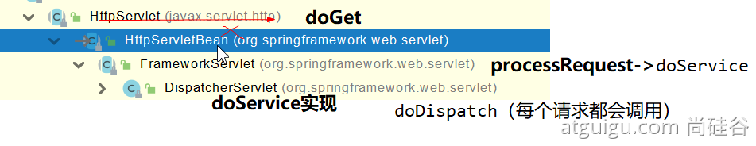
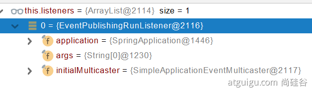

# Springboot2原理笔记

# 1. 容器功能

## 1.1 组件添加

### 1.@Configuration详解

 1.**Full模式与Lite模式**

**1.1 最佳实战**

- 配置类组件之间无依赖关系用Lite模式，加速容器启动过程，减少判断
- 配置类组件之间有依赖关系用Full模式，方法会被调用得到之前单实例组件

**1.2应用实例**

```java
========================================MyConfig配置类====================================
/**
 * 1、配置类里面使用@Bean标注在方法上给容器注册组件，默认也是单实例的
 * 2、配置类本身也是组件
 * 3、proBeanMethods:代理bean的方法
 *      Full：全配置 proxyBeanMethods = true 保证每个@Bean方法被调用多少次返回的组件都是单实例的
 *      lite：轻量级配置 proxyBeanMethods = false 每个@Bean方法被调用多少次返回的都是新创建的
 *      解决问题：组件依赖
 *      组件依赖必须使用Full模式默认。其他默认都是Lite模式
 */
@Configuration(proxyBeanMethods = true)  //配置类
public class MyConfig {

    @Bean
    /**
     * 向容器中添加组件。
     * 以方法名作为组件id。
     * 返回类型就是组件类型。
     * 返回的值，即为组件在容器中的实例
     */
    public User user01(){
        User zhangsan = new User("zhangsan",18,tomcat());
        return zhangsan;
    }


    /**
     * 外部无论对配置类中的这个组件注册方法调用多少次，获取到的都是之前注册容器中的单实例对象
     * @return
     */

    @Bean("tom")
    public Pet tomcat(){
        return new Pet("tom");
    }

}
```

```java
==========================Boot0120220107Application主程序类=============================
@SpringBootApplication
public class Boot0120220107Application {

    public static void main(String[] args) {

        //1、返回IOC容器
        ConfigurableApplicationContext run = SpringApplication.run(Boot0120220107Application.class, args);

        //2.查看容器中的组件
        String[] names = run.getBeanDefinitionNames();
        for (String name : names) {
            System.out.println(name);
        }
        
        //3.从容器中获取组件
        Pet tom1 = run.getBean("tom", Pet.class);
        Pet tom02 = run.getBean("tom", Pet.class);
        if (tom1 == tom02){
            System.out.println("true");
        }

        //4、com.example.boot0120220107.config.MyConfig$$EnhancerBySpringCGLIB$$2a0e7f84@6dcf13ed
        //由SpringCGLIB增强的代理对象
        MyConfig runBean = run.getBean(MyConfig.class);
        System.out.println(runBean);


        //5、如果 @Configuration(proxyBeanMethods = true)，springboot总会检查这个对象是否在容器总已经存在
        //如果有，保持组件单实例
        User user01 = runBean.user01();
        User user02 = runBean.user01();
        System.out.println(user01 == user02);

        //6.验证组建依赖：user01的宠物
        Pet pet = user01.getPet();
        Pet tom = run.getBean("tom",Pet.class);
        System.out.println("张三的宠物：" + (pet == tom));

    }

}
```

### 2、@Import详解

1.**作用：**导入指定类型的组件，调用对应类的无参构造器给容器中自动创建导入类型的组件

2.实例：

```jav
@Import({User.class})
@Configuration(proxyBeanMethods = true)  //配置类
public class MyConfig {
```

```java
==========================Boot0120220107Application主程序类=============================
String[] name1 = run.getBeanNamesForType(User.class);
        for (String s : name1) {
            System.out.println(s);
        }
```

3.@Import 高级用法： https://www.bilibili.com/video/BV1gW411W7wy?p=8

### 3、@Conditional 条件装配

**1.条件装配：满足Conditional指定的条件，则进行组件注入**


**2、实例：@ConditionalOnBean**

```java
========================================MyConfig配置类====================================
	@Bean
    @ConditionalOnBean(name= "tom")
    //当容器中有tom组件时，标注方法（或类）生效
    public User user01(){
        User zhangsan = new User("zhangsan",18,tomcat());
        return zhangsan;
    }

==========================Boot0120220107Application主程序类=============================
		boolean user01 = run.containsBean("user01");
        System.out.println(user01);


```

### 4、@Bean、@Component、@Controller、@Service、@Repository

## 1.2 原生配置文件引入

### 1.@ImportResource导入Spring配置文件

```xml
<?xml version="1.0" encoding="UTF-8"?>
<beans xmlns="http://www.springframework.org/schema/beans"
       xmlns:xsi="http://www.w3.org/2001/XMLSchema-instance"
       xsi:schemaLocation="http://www.springframework.org/schema/beans http://www.springframework.org/schema/beans/spring-beans.xsd">
    <bean class="com.example.boot0120220107.bean.User" id="user">
        <property name="name" value="zhangsan"></property>
        <property name="age" value="18"></property>
    </bean>

    <bean id="cat" class="com.example.boot0120220107.bean.Pet">
        <property name="name" value="tomcat"></property>
    </bean>
</beans>
```

```java
@Import({User.class})
@Configuration(proxyBeanMethods = true)  //配置类
@ImportResource("classpath:beans.xml")
public class MyConfig {
    
        
=====================测试====================
boolean user = run.containsBean("user");
System.out.println(user);

boolean cat = run.containsBean("cat");
System.out.println(cat);


```

## 1.3 配置绑定

### 1. @ConfigurationProperties 

读取配置文件绑定到指定的JavaBean中

```xml
==================application.properties=====================
mycar.brand = byd
mycar.price = 10000
```

### 2.@Component + @ConfigurationProperties

```java
@Component
@ConfigurationProperties(prefix = "mycar") //“prefix = ” 配置文件中的属性的前缀
public class Car {

    private String brand;
    private Integer price;

    public Car(String brand, Integer price) {
        this.brand = brand;
        this.price = price;
    }

    public Car() {
    }

    public String getBrand() {
        return brand;
    }

    public void setBrand(String brand) {
        this.brand = brand;
    }

    public Integer getPrice() {
        return price;
    }

    public void setPrice(Integer price) {
        this.price = price;
    }

    @Override
    public String toString() {
        return "Car{" +
                "brand='" + brand + '\'' +
                ", price=" + price +
                '}';
    }
}

```

### 3. @EnableConfigurationProperties + @ConfigurationProperties

应用场景：当application.properties文件中的某些属性为第三方jar包中的类，而类中无@Component注解时。

```java
@EnableConfigurationProperties(Car.class)
/**@EnableConfigurationProperties
 * 1、必须使用于配置类上
 * 2、开启Car的自动配置功能
 * 3、将Car这个组件自动注册到容器中
 */
public class MyConfig {
}
```

# 2、自动配置原理入门

## 2.1 引导加载自动配置类

```java
======//@SpringBootApplication的组合===========
@SpringBootConfiguration
@EnableAutoConfiguration
@ComponentScan(excludeFilters = { @Filter(type = FilterType.CUSTOM, classes = TypeExcludeFilter.class),
		@Filter(type = FilterType.CUSTOM, classes = AutoConfigurationExcludeFilter.class) })
public @interface SpringBootApplication {
```

### **1.@SpringBootConfiguration**

```java
@Configuration   代表当前是一个配置类
```

### **2.@ComponentScan**

指定扫描哪些包

### **3.@EnableAutoConfiguration**

```java
@AutoConfigurationPackage
@Import(AutoConfigurationImportSelector.class)
public @interface EnableAutoConfiguration {
```

#### **(1) @AutoConfigurationPackage**

自动配置包，指定了默认的包规则

```java
@Import(AutoConfigurationPackages.Registrar.class)  //给容器中导入一个组件
public @interface AutoConfigurationPackage {
```

```java
//利用Registrar给容器中导入一系列组件
//将指定的一个包下的所有组件导入进来？Mainapplication所在包下
static class Registrar implements ImportBeanDefinitionRegistrar, DeterminableImports {

		@Override
		public void registerBeanDefinitions(AnnotationMetadata metadata, BeanDefinitionRegistry registry) {
			register(registry, new PackageImports(metadata).getPackageNames().toArray(new String[0]));
		}

		@Override
		public Set<Object> determineImports(AnnotationMetadata metadata) {
			return Collections.singleton(new PackageImports(metadata));
		}

	}
```

#### **(2)@Import(AutoConfigurationImportSelector.class)**

```java
//1.利用getAutoConfigurationEntry(annotationMetadata)，给容器中导入一批组件
public String[] selectImports(AnnotationMetadata annotationMetadata) {
		if (!isEnabled(annotationMetadata)) {
			return NO_IMPORTS;
		}
		AutoConfigurationEntry autoConfigurationEntry = getAutoConfigurationEntry(annotationMetadata);
		return StringUtils.toStringArray(autoConfigurationEntry.getConfigurations());
	}
//2.利用List<String> configurations = getCandidateConfigurations(annotationMetadata, attributes);获取到所有需要导入到容器中的配置类
//3.利用工厂加载Map<String, List<String>> loadSpringFactories(ClassLoader classLoader)得到所有组件
//4.从META-INF/spring.factories位置加载一个文件
//	默认扫描当前系统中所有META-INF/spring.factories位置的文件
//  spring-boot-autoconfigure-2.6.2.jar里面也有META-INF/spring.factories  
Enumeration<URL> urls = classLoader.getResources(FACTORIES_RESOURCE_LOCATION);
```


```xml
<!--文件写死了spring-boot一启动就要加载的配置类
spring-boot-autoconfigure-2.6.2.jar\META-INF\spring.factories-->
# Auto Configure
org.springframework.boot.autoconfigure.EnableAutoConfiguration=\
org.springframework.boot.autoconfigure.admin.SpringApplicationAdminJmxAutoConfiguration,\
org.springframework.boot.autoconfigure.aop.AopAutoConfiguration,\
org.springframework.boot.autoconfigure.amqp.RabbitAutoConfiguration,\
org.springframework.boot.autoconfigure.batch.BatchAutoConfiguration,\
org.springframework.boot.autoconfigure.cache.CacheAutoConfiguration,\
org.springframework.boot.autoconfigure.cassandra.CassandraAutoConfiguration,\
org.springframework.boot.autoconfigure.context.ConfigurationPropertiesAutoConfiguration,\
org.springframework.boot.autoconfigure.context.LifecycleAutoConfiguration,\
org.springframework.boot.autoconfigure.context.MessageSourceAutoConfiguration,\
org.springframework.boot.autoconfigure.context.PropertyPlaceholderAutoConfiguration,\
org.springframework.boot.autoconfigure.couchbase.CouchbaseAutoConfiguration,\
org.springframework.boot.autoconfigure.dao.PersistenceExceptionTranslationAutoConfiguration,\
org.springframework.boot.autoconfigure.data.cassandra.CassandraDataAutoConfiguration,\
org.springframework.boot.autoconfigure.data.cassandra.CassandraReactiveDataAutoConfiguration,\
org.springframework.boot.autoconfigure.data.cassandra.CassandraReactiveRepositoriesAutoConfiguration,\
org.springframework.boot.autoconfigure.data.cassandra.CassandraRepositoriesAutoConfiguration,\
org.springframework.boot.autoconfigure.data.couchbase.CouchbaseDataAutoConfiguration,\
org.springframework.boot.autoconfigure.data.couchbase.CouchbaseReactiveDataAutoConfiguration,\
org.springframework.boot.autoconfigure.data.couchbase.CouchbaseReactiveRepositoriesAutoConfiguration,\
org.springframework.boot.autoconfigure.data.couchbase.CouchbaseRepositoriesAutoConfiguration,\
org.springframework.boot.autoconfigure.data.elasticsearch.ElasticsearchDataAutoConfiguration,\
org.springframework.boot.autoconfigure.data.elasticsearch.ElasticsearchRepositoriesAutoConfiguration,\
org.springframework.boot.autoconfigure.data.elasticsearch.ReactiveElasticsearchRepositoriesAutoConfiguration,\
org.springframework.boot.autoconfigure.data.elasticsearch.ReactiveElasticsearchRestClientAutoConfiguration,\
org.springframework.boot.autoconfigure.data.jdbc.JdbcRepositoriesAutoConfiguration,\
org.springframework.boot.autoconfigure.data.jpa.JpaRepositoriesAutoConfiguration,\
org.springframework.boot.autoconfigure.data.ldap.LdapRepositoriesAutoConfiguration,\
org.springframework.boot.autoconfigure.data.mongo.MongoDataAutoConfiguration,\
org.springframework.boot.autoconfigure.data.mongo.MongoReactiveDataAutoConfiguration,\
org.springframework.boot.autoconfigure.data.mongo.MongoReactiveRepositoriesAutoConfiguration,\
org.springframework.boot.autoconfigure.data.mongo.MongoRepositoriesAutoConfiguration,\
org.springframework.boot.autoconfigure.data.neo4j.Neo4jDataAutoConfiguration,\
org.springframework.boot.autoconfigure.data.neo4j.Neo4jReactiveDataAutoConfiguration,\
org.springframework.boot.autoconfigure.data.neo4j.Neo4jReactiveRepositoriesAutoConfiguration,\
org.springframework.boot.autoconfigure.data.neo4j.Neo4jRepositoriesAutoConfiguration,\
org.springframework.boot.autoconfigure.data.r2dbc.R2dbcDataAutoConfiguration,\
org.springframework.boot.autoconfigure.data.r2dbc.R2dbcRepositoriesAutoConfiguration,\
org.springframework.boot.autoconfigure.data.redis.RedisAutoConfiguration,\
org.springframework.boot.autoconfigure.data.redis.RedisReactiveAutoConfiguration,\
org.springframework.boot.autoconfigure.data.redis.RedisRepositoriesAutoConfiguration,\
org.springframework.boot.autoconfigure.data.rest.RepositoryRestMvcAutoConfiguration,\
org.springframework.boot.autoconfigure.data.web.SpringDataWebAutoConfiguration,\
org.springframework.boot.autoconfigure.elasticsearch.ElasticsearchRestClientAutoConfiguration,\
org.springframework.boot.autoconfigure.flyway.FlywayAutoConfiguration,\
org.springframework.boot.autoconfigure.freemarker.FreeMarkerAutoConfiguration,\
org.springframework.boot.autoconfigure.groovy.template.GroovyTemplateAutoConfiguration,\
org.springframework.boot.autoconfigure.gson.GsonAutoConfiguration,\
org.springframework.boot.autoconfigure.h2.H2ConsoleAutoConfiguration,\
org.springframework.boot.autoconfigure.hateoas.HypermediaAutoConfiguration,\
org.springframework.boot.autoconfigure.hazelcast.HazelcastAutoConfiguration,\
org.springframework.boot.autoconfigure.hazelcast.HazelcastJpaDependencyAutoConfiguration,\
org.springframework.boot.autoconfigure.http.HttpMessageConvertersAutoConfiguration,\
org.springframework.boot.autoconfigure.http.codec.CodecsAutoConfiguration,\
org.springframework.boot.autoconfigure.influx.InfluxDbAutoConfiguration,\
org.springframework.boot.autoconfigure.info.ProjectInfoAutoConfiguration,\
org.springframework.boot.autoconfigure.integration.IntegrationAutoConfiguration,\
org.springframework.boot.autoconfigure.jackson.JacksonAutoConfiguration,\
org.springframework.boot.autoconfigure.jdbc.DataSourceAutoConfiguration,\
org.springframework.boot.autoconfigure.jdbc.JdbcTemplateAutoConfiguration,\
org.springframework.boot.autoconfigure.jdbc.JndiDataSourceAutoConfiguration,\
org.springframework.boot.autoconfigure.jdbc.XADataSourceAutoConfiguration,\
org.springframework.boot.autoconfigure.jdbc.DataSourceTransactionManagerAutoConfiguration,\
org.springframework.boot.autoconfigure.jms.JmsAutoConfiguration,\
org.springframework.boot.autoconfigure.jmx.JmxAutoConfiguration,\
org.springframework.boot.autoconfigure.jms.JndiConnectionFactoryAutoConfiguration,\
org.springframework.boot.autoconfigure.jms.activemq.ActiveMQAutoConfiguration,\
org.springframework.boot.autoconfigure.jms.artemis.ArtemisAutoConfiguration,\
org.springframework.boot.autoconfigure.jersey.JerseyAutoConfiguration,\
org.springframework.boot.autoconfigure.jooq.JooqAutoConfiguration,\
org.springframework.boot.autoconfigure.jsonb.JsonbAutoConfiguration,\
org.springframework.boot.autoconfigure.kafka.KafkaAutoConfiguration,\
org.springframework.boot.autoconfigure.availability.ApplicationAvailabilityAutoConfiguration,\
org.springframework.boot.autoconfigure.ldap.embedded.EmbeddedLdapAutoConfiguration,\
org.springframework.boot.autoconfigure.ldap.LdapAutoConfiguration,\
org.springframework.boot.autoconfigure.liquibase.LiquibaseAutoConfiguration,\
org.springframework.boot.autoconfigure.mail.MailSenderAutoConfiguration,\
org.springframework.boot.autoconfigure.mail.MailSenderValidatorAutoConfiguration,\
org.springframework.boot.autoconfigure.mongo.embedded.EmbeddedMongoAutoConfiguration,\
org.springframework.boot.autoconfigure.mongo.MongoAutoConfiguration,\
org.springframework.boot.autoconfigure.mongo.MongoReactiveAutoConfiguration,\
org.springframework.boot.autoconfigure.mustache.MustacheAutoConfiguration,\
org.springframework.boot.autoconfigure.neo4j.Neo4jAutoConfiguration,\
org.springframework.boot.autoconfigure.netty.NettyAutoConfiguration,\
org.springframework.boot.autoconfigure.orm.jpa.HibernateJpaAutoConfiguration,\
org.springframework.boot.autoconfigure.quartz.QuartzAutoConfiguration,\
org.springframework.boot.autoconfigure.r2dbc.R2dbcAutoConfiguration,\
org.springframework.boot.autoconfigure.r2dbc.R2dbcTransactionManagerAutoConfiguration,\
org.springframework.boot.autoconfigure.rsocket.RSocketMessagingAutoConfiguration,\
org.springframework.boot.autoconfigure.rsocket.RSocketRequesterAutoConfiguration,\
org.springframework.boot.autoconfigure.rsocket.RSocketServerAutoConfiguration,\
org.springframework.boot.autoconfigure.rsocket.RSocketStrategiesAutoConfiguration,\
org.springframework.boot.autoconfigure.security.servlet.SecurityAutoConfiguration,\
org.springframework.boot.autoconfigure.security.servlet.UserDetailsServiceAutoConfiguration,\
org.springframework.boot.autoconfigure.security.servlet.SecurityFilterAutoConfiguration,\
org.springframework.boot.autoconfigure.security.reactive.ReactiveSecurityAutoConfiguration,\
org.springframework.boot.autoconfigure.security.reactive.ReactiveUserDetailsServiceAutoConfiguration,\
org.springframework.boot.autoconfigure.security.rsocket.RSocketSecurityAutoConfiguration,\
org.springframework.boot.autoconfigure.security.saml2.Saml2RelyingPartyAutoConfiguration,\
org.springframework.boot.autoconfigure.sendgrid.SendGridAutoConfiguration,\
org.springframework.boot.autoconfigure.session.SessionAutoConfiguration,\
org.springframework.boot.autoconfigure.security.oauth2.client.servlet.OAuth2ClientAutoConfiguration,\
org.springframework.boot.autoconfigure.security.oauth2.client.reactive.ReactiveOAuth2ClientAutoConfiguration,\
org.springframework.boot.autoconfigure.security.oauth2.resource.servlet.OAuth2ResourceServerAutoConfiguration,\
org.springframework.boot.autoconfigure.security.oauth2.resource.reactive.ReactiveOAuth2ResourceServerAutoConfiguration,\
org.springframework.boot.autoconfigure.solr.SolrAutoConfiguration,\
org.springframework.boot.autoconfigure.sql.init.SqlInitializationAutoConfiguration,\
org.springframework.boot.autoconfigure.task.TaskExecutionAutoConfiguration,\
org.springframework.boot.autoconfigure.task.TaskSchedulingAutoConfiguration,\
org.springframework.boot.autoconfigure.thymeleaf.ThymeleafAutoConfiguration,\
org.springframework.boot.autoconfigure.transaction.TransactionAutoConfiguration,\
org.springframework.boot.autoconfigure.transaction.jta.JtaAutoConfiguration,\
org.springframework.boot.autoconfigure.validation.ValidationAutoConfiguration,\
org.springframework.boot.autoconfigure.web.client.RestTemplateAutoConfiguration,\
org.springframework.boot.autoconfigure.web.embedded.EmbeddedWebServerFactoryCustomizerAutoConfiguration,\
org.springframework.boot.autoconfigure.web.reactive.HttpHandlerAutoConfiguration,\
org.springframework.boot.autoconfigure.web.reactive.ReactiveMultipartAutoConfiguration,\
org.springframework.boot.autoconfigure.web.reactive.ReactiveWebServerFactoryAutoConfiguration,\
org.springframework.boot.autoconfigure.web.reactive.WebFluxAutoConfiguration,\
org.springframework.boot.autoconfigure.web.reactive.WebSessionIdResolverAutoConfiguration,\
org.springframework.boot.autoconfigure.web.reactive.error.ErrorWebFluxAutoConfiguration,\
org.springframework.boot.autoconfigure.web.reactive.function.client.ClientHttpConnectorAutoConfiguration,\
org.springframework.boot.autoconfigure.web.reactive.function.client.WebClientAutoConfiguration,\
org.springframework.boot.autoconfigure.web.servlet.DispatcherServletAutoConfiguration,\
org.springframework.boot.autoconfigure.web.servlet.ServletWebServerFactoryAutoConfiguration,\
org.springframework.boot.autoconfigure.web.servlet.error.ErrorMvcAutoConfiguration,\
org.springframework.boot.autoconfigure.web.servlet.HttpEncodingAutoConfiguration,\
org.springframework.boot.autoconfigure.web.servlet.MultipartAutoConfiguration,\
org.springframework.boot.autoconfigure.web.servlet.WebMvcAutoConfiguration,\
org.springframework.boot.autoconfigure.websocket.reactive.WebSocketReactiveAutoConfiguration,\
org.springframework.boot.autoconfigure.websocket.servlet.WebSocketServletAutoConfiguration,\
org.springframework.boot.autoconfigure.websocket.servlet.WebSocketMessagingAutoConfiguration,\
org.springframework.boot.autoconfigure.webservices.WebServicesAutoConfiguration,\
org.springframework.boot.autoconfigure.webservices.client.WebServiceTemplateAutoConfiguration
```

## 2.2 按需开启自动配置项

```java
虽然META-INF/spring.factories中的# Auto Configure中的场景
所有自动配置的时候默认全部加载。XXXXAutoConfiguration
按照条件装配规则（@Conditional），最终会按需加载
```

## 2.3 修改默认配置

```java
给容器中加入了文件上传解析器
		@Bean
		//容器中有这个类型组件
		@ConditionalOnBean(MultipartResolver.class)
		//容器中没有这个叫做multipartResolver的组件
		@ConditionalOnMissingBean(name = DispatcherServlet.MULTIPART_RESOLVER_BEAN_NAME)
		public MultipartResolver multipartResolver(MultipartResolver resolver) {
        //@Bean标注的方法传入了对象参数，这个参数的值就会在容器中寻找
        //SpringMVC multipartResolver 防止有些用户配置的文件上传解析器不符合规范
		// Detect if the user has created a MultipartResolver but named it incorrectly
			return resolver;
		}
```

SpringBoot默认会在底层配好所有的组件，但是如果用户自己配置了以用户的优先

```java
//底层配置，以CharacterEncodingFilter为例    
    @Bean
	@ConditionalOnMissingBean
	public CharacterEncodingFilter characterEncodingFilter() {
		CharacterEncodingFilter filter = new OrderedCharacterEncodingFilter();
		filter.setEncoding(this.properties.getCharset().name());
		filter.setForceRequestEncoding(this.properties.shouldForce(Encoding.Type.REQUEST));
		filter.setForceResponseEncoding(this.properties.shouldForce(Encoding.Type.RESPONSE));
		return filter;
	}

//自己配置，在配置类中
 @Bean
 public CharacterEncodingFilter filter(){
        return null;
 }
```

总结：

- SpringBoot先加载所有的自动配置类，xxxxAutoConfiguration
- 每个自动配置类按照条件进行生效，默认都会绑定配置文件指定的值。xxxxProPerties里面拿。xxxxProperties和配置文件进行了绑定
- 生效的配置类就会给容器中装配很多组件
- 只要容器中有这些组件，相当于这些功能就有了
- 定制化配置
  - 用户直接自己@Bean替换底层的组件
  - 用户去看这个组件是获取的配置文件什么值就去修改

   <font color = 'red'>**xxxxAutoConfiguration --> 组件 ---> xxxxProperties 里面拿值 ---> application.properties**</font>

## 2.4 最佳实战

- 引入场景依赖
  - https://docs.spring.io/spring-boot/docs/current/reference/html/using-spring-boot.html#using-boot-starter

- 查看自动配置了哪些（选做）
  - 自己分析，引入场景对应的自动配置类一般都生效了
  - 配置文件中debug = true 开启自动配置报告。Negative（不生效）\positive（生效）
- 是否需要修改
  - 参照文档修改配置项
    - https://docs.spring.io/spring-boot/docs/current/reference/html/application-properties.html#application-properties
    - 自己分析。xxxxProperties绑定了配置文件的哪些。
  - 自定义加入或者替换组件
    - @Bean、@Component。。。
  - ......	

# 3. 开发小技巧

## 3.1 Lombok

简化JavaBean开发

```xml
        <dependency>
            <groupId>org.projectlombok</groupId>
            <artifactId>lombok</artifactId>
        </dependency>


idea中搜索安装lombok插件
```

```java
===============================简化JavaBean开发===================================
@NoArgsConstructor
//@AllArgsConstructor
@Data
@ToString
@EqualsAndHashCode
public class User {

    private String name;
    private Integer age;

    private Pet pet;

    public User(String name,Integer age){
        this.name = name;
        this.age = age;
    }


}


================================简化日志开发===================================
@Slf4j
@RestController
public class HelloController {
    @RequestMapping("/hello")
    public String handle01(@RequestParam("name") String name){
        
        log.info("请求进来了....");
        
        return "Hello, Spring Boot 2!"+"你好："+name;
    }
}
```

## 4.2 dev-tools

```xml
        <dependency>
            <groupId>org.springframework.boot</groupId>
            <artifactId>spring-boot-devtools</artifactId>
            <optional>true</optional>
        </dependency>

项目或页面修改以后：Ctrl+F9
```

## 4.3 Spring Initailizr（项目初始化向导）

### 0、选择我们需要开发的场景


### 1、自动依赖引入

.png)

### 2、自动创建项目结构

.png)

### 3、自动编写好主配置类

.png)

# 4、配置文件

## 1、文件类型

### 1.1 properties

同以前的properties用法

### 1.2 yaml

#### 1.2.1 简介

YAML是“YAML Ain‘t Markup Language”(YAML不是一种标记语言)的递归缩写。在开发这种

语言时，YAML的意思其实是：“Yet Another Markup Language”（仍是一种标记语言）。

非常适合用来做==以数据为中心的==配置文件

#### 1.2.2 基本语法

+ key：value；k，v之间有空格
+ ==大小写敏感==
+ 使用缩进表示层级关系
+ ==缩进不允许使用tab，只允许使用空格==
+ 缩进的空格数不重要，只要==相同层级的元素左对齐即可==
+ ’#‘表示注释
+ ==字符串无需加引号==，如果要加，’‘与’‘ ’‘ 表示字符串内容，会被==转义/不转义==

#### 1.2.3 数据类型

+ ==字面量==:单个的、不可再分的值。date、boolean、string、number、null

```yaml
  k: v
```

+ 对象：键值对的集合。map、hash、set、object

```yaml
行内写法：k：{k1: v1,k2: v2,k3: v3}
#或
k：
 k1: v1
 k2: v2
 k3: v3
```

+ 数组：一组按次序排列的值。array、list、queue

```yaml
行内写法：k: [v1,v2,v3]
#或
k:
 - v1
 - v2
 - v3
```

#### 1.2.4 实例

```java
=============================Boot02HelloworldApplication=================================
@ConfigurationProperties(prefix = "person")
@Component
@ToString
@Data
public class Person {
    private String userName;
    private Boolean boss;
    private Date birth;
    private Integer age;
    private Pet pet;
    private String[] interests;
    private List<String> animal;
    private Map<String, Object> score;
    private Set<Double> salarys;
    private Map<String, List<Pet>> allPets;
}

@ToString
@Data
public class Pet {
    private String name;
    private Double weight;
}
```

```yaml
person:
#  双引号控制台换行输出
#  username: "zhangsan \n hello"
#  单引号控制台 \n 输出
#  username: 'zhangsan \n hello'
#  双引号会将 \n 作为换行输出，单引号会将 \n 作为字符串输出
#  双引号不会发生转义，单引号会发生转义
  boss: true
  birth: 2019/01/09
  age: 18
  pet:
    name: 小红
    weight: 98
#  interests: [篮球,羽毛球,足球]
  interests:
    - 篮球
    - 足球
    - 18
#  animal: [阿毛,阿狗]
  animal:
    - marry
    - dog
#  score: {"math":"18","english":10}
  score:
    math: 18
    english: 10
  salarys:
    - 99.01
    - 89.12
  allPets:
    sick:
      - {name: 阿狗,weight: 88}
      - name: 阿猫
        weight: 99
      - name: 阿虫
        weight: 78.77
    health:
      - name: 一一
        weight: 99.45
      - name: 二一
        weight: 98.89
```

## 2、配置提示

自定义的类和配置文件绑定一般没有提示

```xml
<dependency>
            <groupId>org.springframework.boot</groupId>
            <artifactId>spring-boot-configuration-processor</artifactId>
            <optional>true</optional>
</dependency>

 <build>
        <plugins>
            <plugin>
                <groupId>org.springframework.boot</groupId>
                <artifactId>spring-boot-maven-plugin</artifactId>
                <configuration>
                    <excludes>
                        <exclude>
                            <groupId>org.springframework.boot</groupId>
                            <artifactId>spring-boot-configuration-processor</artifactId>
                        </exclude>
                    </excludes>
                </configuration>
            </plugin>
        </plugins>
    </build>
```

# 5、Web开发


## 1. SpringMVC自动配置概览

Spring Boot provides auto-configuration for Spring MVC that **works well with most applications.(大多场景我们都无需自定义配置)**

The auto-configuration adds the following features on top of Spring’s defaults:

- Inclusion of `ContentNegotiatingViewResolver` and `BeanNameViewResolver` beans.

- - 内容协商视图解析器和BeanName视图解析器

- Support for serving static resources, including support for WebJars (covered [later in this document](https://docs.spring.io/spring-boot/docs/current/reference/html/spring-boot-features.html#boot-features-spring-mvc-static-content))).

- - 静态资源（包括webjars）

- Automatic registration of `Converter`, `GenericConverter`, and `Formatter` beans.

- - 自动注册 `Converter，GenericConverter，Formatter `

- Support for `HttpMessageConverters` (covered [later in this document](https://docs.spring.io/spring-boot/docs/current/reference/html/spring-boot-features.html#boot-features-spring-mvc-message-converters)).

- - 支持 `HttpMessageConverters` （后来我们配合内容协商理解原理）

- Automatic registration of `MessageCodesResolver` (covered [later in this document](https://docs.spring.io/spring-boot/docs/current/reference/html/spring-boot-features.html#boot-features-spring-message-codes)).

- - 自动注册 `MessageCodesResolver` （国际化用）

- Static `index.html` support.

- - 静态index.html 页支持

- Custom `Favicon` support (covered [later in this document](https://docs.spring.io/spring-boot/docs/current/reference/html/spring-boot-features.html#boot-features-spring-mvc-favicon)).

- - 自定义 `Favicon`  

- Automatic use of a `ConfigurableWebBindingInitializer` bean (covered [later in this document](https://docs.spring.io/spring-boot/docs/current/reference/html/spring-boot-features.html#boot-features-spring-mvc-web-binding-initializer)).

- - 自动使用 `ConfigurableWebBindingInitializer` ，（DataBinder负责将请求数据绑定到JavaBean上）

If you want to keep those Spring Boot MVC customizations and make more [MVC customizations](https://docs.spring.io/spring/docs/5.2.9.RELEASE/spring-framework-reference/web.html#mvc) (interceptors, formatters, view controllers, and other features), you can add your own `@Configuration` class of type `WebMvcConfigurer` but **without** `@EnableWebMvc`.

**不用@EnableWebMvc注解。使用** `**@Configuration**` **+** `**WebMvcConfigurer**` **自定义规则**


If you want to provide custom instances of `RequestMappingHandlerMapping`, `RequestMappingHandlerAdapter`, or `ExceptionHandlerExceptionResolver`, and still keep the Spring Boot MVC customizations, you can declare a bean of type `WebMvcRegistrations` and use it to provide custom instances of those components.

**声明** `**WebMvcRegistrations**` **改变默认底层组件**


If you want to take complete control of Spring MVC, you can add your own `@Configuration` annotated with `@EnableWebMvc`, or alternatively add your own `@Configuration`-annotated `DelegatingWebMvcConfiguration` as described in the Javadoc of `@EnableWebMvc`.

**使用** `**@EnableWebMvc+@Configuration+DelegatingWebMvcConfiguration 全面接管SpringMVC**`

## 2. 简单功能分析

### 2.1 静态资源访问

#### 1、静态资源目录

只要静态资源放在类路径下：called /static（or /public or /resources or /META-INF/resources ）

访问 ：当前项目根路径/ + 静态资源名

原理： 静态映射/** 。(/** ：拦截所有请求)

请求进来，先去找Controller看是否能处理。不能处理的所有请求又都交给静态资源处理器。静态资源也找不到则响应404页面

改变默认的静态资源路径

```xml
spring:
  mvc:
    static-path-pattern: /res/**
  web:
    resources:
      static-locations: [classpath:/haha/]
```

#### 2. 静态资源访问前缀

默认无前缀

```xml
spring:
  mvc:
    static-path-pattern: /res/**
```

当前项目 + static-path-pattern + 静态资源名 = 静态资源文件夹下载 

#### 3、webjar

自动映射 /[webjars](http://localhost:8080/webjars/jquery/3.5.1/jquery.js)/**

https://www.webjars.org/

```xml
        <dependency>
            <groupId>org.webjars</groupId>
            <artifactId>jquery</artifactId>
            <version>3.5.1</version>
        </dependency>
```

访问地址：[http://localhost:8080/webjars/**jquery/3.5.1/jquery.js**](http://localhost:8080/webjars/jquery/3.5.1/jquery.js)   后面地址要按照依赖里面的包路径

### 2.2 欢迎页支持

+ 静态资源路径下 index.html
  + 可以配置静态资源路径
  + 但是不可以配置静态资源的访问前缀。否则导致index.html不能被默认访问

在没有配置静态资源访问前缀的情况下，index.html可以被默认访问；

在配置前缀的情况下，要想访问静态资源路径下的index.html,则为“http://localhost:8080/res/index.html”

原因：index.html的存储路径没变，仍在静态资源路径下；而==加入前缀后，访问静态资源的虚拟路径改变==，所以默认路径无法访问。

```xml
spring:
# mvc:
#    static-path-pattern: /res/**
  web:
    resources:
      static-locations: [classpath:/haha/]

```

+ controller能处理/index

```java
===============================Boot05Web01Application====================================
@Controller
public class HelloController {
    /**
    当配置静态资源访问前缀时，该路径无法访问。
    */
    @RequestMapping("/index")
    public String hello(){
        return "index.html";
    }
}
@Controller
public class HelloController {
	/**
    当配置静态资源访问前缀时
    */
    @RequestMapping("/index")
    public String hello(){
        return "/res/index1.html";
    }
}
```

### 2.3 自定义 Favicon

favicon.ico 放在静态资源目录下即可。

```xml
spring:
#  mvc:
#    static-path-pattern: /res/**   这个会导致 Favicon 功能失效
```

### 2.4 静态资源配置原理

+ SpringBoot启动默认加载 xxxxAutoConfiguration类（自动配置类）
+ SpringMVC功能的自动配置类WebMvcAutoConfiguration，生效

```java
@Configuration(proxyBeanMethods = false)
@ConditionalOnWebApplication(type = Type.SERVLET)
@ConditionalOnClass({ Servlet.class, DispatcherServlet.class, WebMvcConfigurer.class })
@ConditionalOnMissingBean(WebMvcConfigurationSupport.class)
@AutoConfigureOrder(Ordered.HIGHEST_PRECEDENCE + 10)
@AutoConfigureAfter({ DispatcherServletAutoConfiguration.class, TaskExecutionAutoConfiguration.class,
		ValidationAutoConfiguration.class })
public class WebMvcAutoConfiguration {}
```

+ 给容器中配了什么。

```java
	@Configuration(proxyBeanMethods = false)
	@Import(EnableWebMvcConfiguration.class)
	@EnableConfigurationProperties({ WebMvcProperties.class, WebProperties.class })
	@Order(0)
	public static class WebMvcAutoConfigurationAdapter implements WebMvcConfigurer, ServletContextAware {
```

+ 配置文件的相关属性和xxx进行了绑定。WebMvcProperties == spring.mvc，WebProperties == spring.web

#### 1. 配置类只有一个有参构造器

```java
//有参构造器所有参数的值都会从容器中确定
//WebProperties webProperties ：获取和spring.web绑定的所有的值的对象
//WebMvcProperties mvcProperties ：获取和spring.mvc绑定的所有的值的对象
//ListableBeanFactory beanFactory ：Spring的beanFactory
//HttpMessageConverters ：找到所有的HttpMessageConverters
//ResourceHandlerRegistrationCustomizer ：找到资源处理器的自定义器。
//DispatcherServletPath ：前端控制器的拦截路径
//ServletRegistrationBean ：给应用注册Servlet、Filter....
public WebMvcAutoConfigurationAdapter(WebProperties webProperties, WebMvcProperties mvcProperties,
				ListableBeanFactory beanFactory, ObjectProvider<HttpMessageConverters> messageConvertersProvider,
				ObjectProvider<ResourceHandlerRegistrationCustomizer> resourceHandlerRegistrationCustomizerProvider,
				ObjectProvider<DispatcherServletPath> dispatcherServletPath,
				ObjectProvider<ServletRegistrationBean<?>> servletRegistrations) {
			this.resourceProperties = webProperties.getResources();
			this.mvcProperties = mvcProperties;
			this.beanFactory = beanFactory;
			this.messageConvertersProvider = messageConvertersProvider;
			this.resourceHandlerRegistrationCustomizer = resourceHandlerRegistrationCustomizerProvider.getIfAvailable();
			this.dispatcherServletPath = dispatcherServletPath;
			this.servletRegistrations = servletRegistrations;
			this.mvcProperties.checkConfiguration();
		}
```

#### 2. 资源处理的默认规则

```java
	@Override
		public void addResourceHandlers(ResourceHandlerRegistry registry) {
			if (!this.resourceProperties.isAddMappings()) {
				logger.debug("Default resource handling disabled");
				return;
			}
			addResourceHandler(registry, "/webjars/**", "classpath:/META-INF/resources/webjars/");
			addResourceHandler(registry, this.mvcProperties.getStaticPathPattern(), (registration) -> {				registration.addResourceLocations(this.resourceProperties.getStaticLocations());
				if (this.servletContext != null) {
					ServletContextResource resource = new ServletContextResource(this.servletContext, SERVLET_LOCATION);
					registration.addResourceLocations(resource);
				}
			});
		}
```

```xml
spring:
  web:
    resources:
      add-mappings: false  禁用所有静态资源    
```

```java
private static final String[] CLASSPATH_RESOURCE_LOCATIONS = { "classpath:/META-INF/resources/","classpath:/resources/", "classpath:/static/", "classpath:/public/" };
/**
* Locations of static resources. Defaults to classpath:[/META-INF/resources/,
* /resources/, /static/, /public/].
*/
private String[] staticLocations = CLASSPATH_RESOURCE_LOCATIONS;

public String[] getStaticLocations() {
			return this.staticLocations;
		}
```

#### 3.欢迎页的处理规则

```java
//HandlerMapping：处理器映射。保存了每一个 Handler能处理哪些请求
		@Bean
		public WelcomePageHandlerMapping welcomePageHandlerMapping(ApplicationContext applicationContext,
				FormattingConversionService mvcConversionService, ResourceUrlProvider mvcResourceUrlProvider) {
			WelcomePageHandlerMapping welcomePageHandlerMapping = new WelcomePageHandlerMapping(
					new TemplateAvailabilityProviders(applicationContext), applicationContext, getWelcomePage(),
					this.mvcProperties.getStaticPathPattern());
			welcomePageHandlerMapping.setInterceptors(getInterceptors(mvcConversionService, mvcResourceUrlProvider));
			welcomePageHandlerMapping.setCorsConfigurations(getCorsConfigurations());
			return welcomePageHandlerMapping;
		}
=========================================================================================
WelcomePageHandlerMapping(TemplateAvailabilityProviders templateAvailabilityProviders,
			ApplicationContext applicationContext, Resource welcomePage, String staticPathPattern) {
		if (welcomePage != null && "/**".equals(staticPathPattern)) {
            //要用欢迎页功能，必须是/**
			logger.info("Adding welcome page: " + welcomePage);
			setRootViewName("forward:index.html");
		}
		else if (welcomeTemplateExists(templateAvailabilityProviders, applicationContext)) {
            // 调用Controller  /index
			logger.info("Adding welcome page template: index");
			setRootViewName("index");
		}
	}
```

#### 4. favicon

浏览器会发送/favicon.ico请求

浏览器都是默认访问当前项目下的favicon.ico,所以加了前缀之后，访问路径不在当前目录下，要有前缀才能访问，浏览器自然访问不到

## 3. 请求参数处理

### 0. 请求映射

#### 1. rest使用与原理

+ @xxxMapping;

+ Rest风格支持（使用HTTP请求方式动词来表示对资源的操作）

  + *以前：/getUser  获取用户  /deleteUser 删除用户  /editUser 修改用户  /saveUser 保存用户*

  + **现在** ： */user*   *GET-获取用户*    *DELETE-删除用户*     *PUT-修改用户*      *POST-保存用户*

  + 核心Filter：HiddenHttpMethodFilter

    + 用法：表单<u>method=post</u>,隐藏域_method = put

      ```html
      <form action="/user" method="post">
          <input name="_method" type="hidden" value="delete"/>
          <!--<input name="_m" type="hidden" value="delete"/>-->
          <input value="REST-DELETE 提交" type="submit"/>
      </form>
      <form action="/user" method="post">
          <input name="_method" type="hidden" value="PUT"/>
          <input value="REST-PUT 提交" type="submit"/>
      </form>
      ```

      

    + SpringBoot中手动开启

      ```xml
      spring:
        mvc:
          hiddenmethod:
            filter:
              enabled: true   #开启页面表单的Rest功能
      ```

      

  + 扩展：如何把_method这个名字换成自己喜欢的

  ```java
  //自定义filter
  @Configuration(proxyBeanMethods = false)
  public class Myconfig {
      @Bean
      public HiddenHttpMethodFilter hiddenHttpMethodFilter(){
          HiddenHttpMethodFilter methodFilter = new HiddenHttpMethodFilter();
          methodFilter.setMethodParam("_m");
          return methodFilter;
      }
  }
  ```

```java
=================================Boot05Web01Application==================================
	@Bean
	@ConditionalOnMissingBean(HiddenHttpMethodFilter.class)
	@ConditionalOnProperty(prefix = "spring.mvc.hiddenmethod.filter", name = "enabled")
	public OrderedHiddenHttpMethodFilter hiddenHttpMethodFilter() {
		return new OrderedHiddenHttpMethodFilter();
	}
        
    @RequestMapping(value = "/user",method = RequestMethod.GET)
    public String getUser(){
        return "GET-张三";
    }

    @RequestMapping(value = "/user",method = RequestMethod.POST)
    public String saveUser(){
        return "POST-张三";
    }


    @RequestMapping(value = "/user",method = RequestMethod.PUT)
    public String putUser(){
        return "PUT-张三";
    }

    @RequestMapping(value = "/user",method = RequestMethod.DELETE)
    public String deleteUser(){
        return "DELETE-张三";
    }
```

Rest原理（表单提交要使用REST的时候）

+ 表单提交会被带上 **_method = PUT**
+ **请求过来会被**HiddenHttpMethodFilter拦截
  + 请求是否正常，并且是POST
    + 获取到 **_method**的值
    + 兼容以下请求：PUT，DELETE, PATCH.
    + **原生request（post），包装模式requestWrapper重写了getMethod方法，返回的是传入的值**
    + **过滤器链放行的时候用wrapper。以后的方法调用getMethod是调用requestWrapper的。**

**Rest使用客户端工具**

+ 如PostMan直接发送Put、delete等方式请求，无需Filter。

```java
public class HiddenHttpMethodFilter extends OncePerRequestFilter {

	private static final List<String> ALLOWED_METHODS =
			Collections.unmodifiableList(Arrays.asList(HttpMethod.PUT.name(),
					HttpMethod.DELETE.name(), HttpMethod.PATCH.name()));

	/** Default method parameter: {@code _method}. */
	public static final String DEFAULT_METHOD_PARAM = "_method";

	private String methodParam = DEFAULT_METHOD_PARAM;
	/**
	 * Set the parameter name to look for HTTP methods.
	 * @see #DEFAULT_METHOD_PARAM
	 */
	public void setMethodParam(String methodParam) {
		Assert.hasText(methodParam, "'methodParam' must not be empty");
		this.methodParam = methodParam;
	}

	@Override
	protected void doFilterInternal(HttpServletRequest request, HttpServletResponse response, FilterChain filterChain)
			throws ServletException, IOException {

		HttpServletRequest requestToUse = request;

		if ("POST".equals(request.getMethod()) && request.getAttribute(WebUtils.ERROR_EXCEPTION_ATTRIBUTE) == null) {
            //getParameter获取前端请求的值
			String paramValue = request.getParameter(this.methodParam);
			if (StringUtils.hasLength(paramValue)) {
				String method = paramValue.toUpperCase(Locale.ENGLISH);
				if (ALLOWED_METHODS.contains(method)) {
					requestToUse = new HttpMethodRequestWrapper(request, method);
				}
			}
		}

		filterChain.doFilter(requestToUse, response);
	}


	/**
	 * Simple {@link HttpServletRequest} wrapper that returns the supplied method for
	 * {@link HttpServletRequest#getMethod()}.
	 */
	private static class HttpMethodRequestWrapper extends HttpServletRequestWrapper {

		private final String method;

		public HttpMethodRequestWrapper(HttpServletRequest request, String method) {
			super(request);
			this.method = method;
		}

		@Override
		public String getMethod() {
			return this.method;
		}
	}

}
```

#### 2. 请求映射原理



**SpringMVC功能分析都从 org.springframework.web.servlet.DispatcherServlet-》doDispatch（）开始**

```java
protected void doDispatch(HttpServletRequest request, HttpServletResponse response) throws Exception {
		HttpServletRequest processedRequest = request;
		HandlerExecutionChain mappedHandler = null;
		boolean multipartRequestParsed = false;

		WebAsyncManager asyncManager = WebAsyncUtils.getAsyncManager(request);

		try {
			ModelAndView mv = null;
			Exception dispatchException = null;

			try {
				processedRequest = checkMultipart(request);
				multipartRequestParsed = (processedRequest != request);

				// Determine handler for the current request.
                //找到当前请求使用哪个Handler（controller的方法）处理
				mappedHandler = getHandler(processedRequest);
				if (mappedHandler == null) {
					noHandlerFound(processedRequest, response);
					return;
				}
                //HandlerMapping：处理器映射。/xxx->>xxxx
```


**RequestMappingHandlerMappering:保存了所有@RequestMapping和handler的映射规则**

.png)

所有的请求映射都在**HandlerMappering**中。

+ SpringBoot自动配置欢迎页的**WelcomePageHandlerMapping**。访问 / 能访问到index.html;
+ SpringBoot自动配置了默认的RequestMappingHandlerMapping
+ 请求进来，挨个尝试所有的HandlerMapping看是否有请求信息。
  + 如果有就找到这个请求对应的handler
  + 如果没有就是下一个HandlerMapping
+ 我们需要一些自定义的映射处理，也可以自己向容器中放**HandlerMapping**。自定义**HandlerMapping**。

```java
@Nullable
	protected HandlerExecutionChain getHandler(HttpServletRequest request) throws Exception {
		if (this.handlerMappings != null) {
			for (HandlerMapping mapping : this.handlerMappings) {
				HandlerExecutionChain handler = mapping.getHandler(request);
				if (handler != null) {
					return handler;
				}
			}
		}
		return null;
	}
```

### 1. 普通参数与基本注解

#### 1.1 注解：

@PathVariable、@RequestHeader、@RequestAttribute、@RequestParam、@MatrixVariable、@CookieValue、@RequestBody

```html
<ul>
    <!--<a href="/car/3/owner/zhangsan">/car/{id}/owner/{username}</a>-->
    <a href="car/3/owner/lisi?age=18&inters=basketball&inters=game">car/{id}/owner/{username}</a>
    <li>@PathVariable（路径变量）</li>
    <li>@RequestHeader（获取请求头）</li>
    <li>@RequestParam（获取请求参数）</li>
    <li>@CookieValue（获取cookie值）</li>
    <li>@RequestBody（获取请求体[POST]）</li>
</ul>
```

```java
	//  car/2/owner/zhangsan
    @GetMapping("/car/{id}/owner/{username}")
    public Map<String,Object> getCar(@PathVariable("id") Integer id,
                                     @PathVariable("username") String username,
                                     @PathVariable Map<String,Object> pv,
                                     @RequestHeader("user-agent") String userAgent,
                                     @RequestHeader Map<String,String> mv,
                                     @RequestParam("age") Integer age,
                                     @RequestParam("inters") List<String> inters,
                                     @RequestParam Map<String,String> rv,
                                     @CookieValue("Pycharm-55812772") String ck,
                                     @CookieValue("Pycharm-55812772") Cookie cookie){
        Map<String, Object> map = new HashMap<>();
        //map.put("id",id);
        //map.put("username",username);
        //map.put("pv",pv);
        //map.put("user-agent",userAgent);
        //map.put("mv",mv);
        map.put("age",age);
        map.put("inters",inters);
        map.put("rv",rv);
        map.put("Pycharm-55812772",ck);
        System.out.println("Pycharm-55812772========>" + cookie.getName() + 	cookie.getValue());
        return map;
    }
```

```html
<li>@RequestBody（获取请求体[POST]）</li>
<form action="/save" method="post">
    测试@RequestBody获取数据 <br/>
    用户名：<input name="userName"/> <br>
    邮箱：<input name="email"/>
    <input type="submit" value="提交"/>
</form>
```

```java
	@PostMapping("/save")
    public Map postBody(@RequestBody String content) throws Exception {
        Map<String, Object> map = new HashMap<>();
        //解码，使中文和特殊字符正常显示
        String result = URLDecoder.decode(content, "utf-8");
        map.put("content",result);
        System.out.println(map);
        return map;
    }
	@PostMapping("/save")
    public Map postBody(@RequestBody String content,@RequestParam String userName) throws Exception {
        Map<String, Object> map = new HashMap<>();
        //解码，使中文和特殊字符正常显示
        String result = URLDecoder.decode(content, "utf-8");
        map.put("content",result);
        map.put("userName",userName);
        System.out.println(map);
        return map;
    }
```

```java
//<li>@RequestAttribute（获取request域属性）</li>
//测试@RequestAttribute
@Controller
public class RequestController {
    @GetMapping("/gotoPage")
    public String goTo(HttpServletRequest request){
        request.setAttribute("msg","成功了....");
        request.setAttribute("code",200);
        return "forward:/success";  //转发到 /success
    }

    @ResponseBody
    @GetMapping("/success")
    public Map success(@RequestAttribute("msg") String msg,
                       @RequestAttribute("code") Integer code,
                       HttpServletRequest request){
        Map<String, Object> map = new HashMap<>();
        Object msg1 = request.getAttribute("msg");
        Object code1 = request.getAttribute("code");
        map.put("reqMethod",msg1);
        map.put("reqcode",code1);
        map.put("annotationMethod",msg);
        map.put("annotationCode",code);
        return map;
    }

}
```

```html
<li>@MatrixVariable（矩阵变量）</li>
/boss/1/2
/boss/1;age=20/2;age=20

<a href="/cars/sell;low=34;brand=byd,audi,yd">@MatrixVariable（矩阵变量）</a>
<a href="/cars/sell;low=34;brand=byd;brand=audi;brand=yd">@MatrixVariable（矩阵变量）</a>
<a href="/boss/1;age=20/2;age=10">@MatrixVariable（矩阵变量）/boss/{bossId}/{empId}</a>
<br/>

<ol>
    <li>矩阵变量需要在SpringBoot中手动开启（旧版本，2.6不用）</li>
    <li>根据RFC3986的规范，矩阵变量应当绑定在路径变量中！</li>
    <li>若是有多个矩阵变量，应当使用英文符号;进行分隔。</li>
    <li>若是一个矩阵变量有多个值，应当使用英文符号,进行分隔，或之命名多个重复的key即可。</li>
    <li>如：/cars/sell;low=34;brand=byd,audi,yd</li>
</ol>
<hr/>
```

```java
	//矩阵变量必须有url路径变量才能被解析
    // /cars/sell;low=34;brand=byd,audi,yd
    @GetMapping("/cars/{path}")
    public Map carsSell(@MatrixVariable("low") Integer low,
                        @MatrixVariable("brand") List<String> brand,
                        @PathVariable("path") String path){
        Map<String, Object> map = new HashMap<>();
        map.put("low",low);
        map.put("brand",brand);
        map.put("path",path);
        return map;
    }

    // /boss/1;age=20/2;age=10
    @GetMapping("/boss/{bossId}/{empId}")
    public Map boss(@MatrixVariable(value = "age",pathVar = "bossId") Integer bossAge,
                    @MatrixVariable(value = "age",pathVar = "empId") Integer empAge,
                    @PathVariable("bossId") Integer bossId,
                    @PathVariable("empId") Integer empId){
        Map<String, Object> map = new HashMap<>();
        map.put("bossAge",bossAge);
        map.put("empAge",empAge);
        map.put("bossId",bossId);
        map.put("empId",empId);
        return map;
    }
```

```java
//若需要手动开启矩阵变量，则在配置类中进行配置，实现WebMvcConfigurer接口中的configurePathMatch
//对于路径的处理。UrlPathHelper进行解析。
//removeSemicolonContent（移除分号内容）支持矩阵变量的
@Configuration(proxyBeanMethods = false)
public class Myconfig implements WebMvcConfigurer {
    @Override
    public void configurePathMatch(PathMatchConfigurer configurer) {
        UrlPathHelper urlPathHelper = new UrlPathHelper();
        // 不移除；后面的内容。矩阵变量功能就可以生效
        urlPathHelper.setRemoveSemicolonContent(false);
        configurer.setUrlPathHelper(urlPathHelper);
    }
}

//或不实现WebMvcConfigurer
@Configuration(proxyBeanMethods = false)
public class Myconfig /*implements WebMvcConfigurer*/ {
    @Bean
    public WebMvcConfigurer webMvcConfigurer(){
        return new WebMvcConfigurer() {
            @Override
            public void configurePathMatch(PathMatchConfigurer configurer) {
                UrlPathHelper urlPathHelper = new UrlPathHelper();
                // 不移除；后面的内容。矩阵变量功能就可以生效
                urlPathHelper.setRemoveSemicolonContent(false);
                configurer.setUrlPathHelper(urlPathHelper);
            }
        };
    }
}
```

#### 1.2 Servlet API：

WebRequest、ServletRequest、MultipartRequest、HttpSession、javax.servlet.http.PushBuilder、Principal、InputStream、Reader、HttpMethod、Locale、TimeZone、Zoneld

**ServletRequestMethodArgumentResolver**以上的部分参数

```java
=========================ServletRequestMethodArgumentResolver======================
	@Override
	public boolean supportsParameter(MethodParameter parameter) {
		Class<?> paramType = parameter.getParameterType();
		return (WebRequest.class.isAssignableFrom(paramType) ||
				ServletRequest.class.isAssignableFrom(paramType) ||
				MultipartRequest.class.isAssignableFrom(paramType) ||
				HttpSession.class.isAssignableFrom(paramType) ||
				(pushBuilder != null && pushBuilder.isAssignableFrom(paramType)) ||
				(Principal.class.isAssignableFrom(paramType) && !parameter.hasParameterAnnotations()) ||
				InputStream.class.isAssignableFrom(paramType) ||
				Reader.class.isAssignableFrom(paramType) ||
				HttpMethod.class == paramType ||
				Locale.class == paramType ||
				TimeZone.class == paramType ||
				ZoneId.class == paramType);
	}
```

#### 1.3 复杂参数

**Map、Model（map、model里面的数据会被放在request的请求域 request.setAttribute）**、Errors/BindingResult、**RedirectAttributes(重定向携带数据)**、**ServletResponse（response）**、

SessionStatus、UriComponentsBuilder、ServletUriComponentsBuilder

```java
Map<String,Object> map,  Model model, HttpServletRequest request 都是可以给request域中放数据，
request.getAttribute();
```

```java
	@GetMapping("/params")
    public String testParam(Map map,Model model,
                            HttpServletRequest request,
                            HttpServletResponse response){
        map.put("hello","world666");
        model.addAttribute("world","hello666");
        request.setAttribute("message","成功了。。。");
        Cookie cookie = new Cookie("c1","c1");
        response.addCookie(cookie);
        return "forward:/success";
    }

    @ResponseBody
    @GetMapping("/success")
    public Map success(@RequestAttribute(value = "msg",required =false) String msg,
                       @RequestAttribute(value = "code",required = false) Integer code,
                       HttpServletRequest request){
        Map<String, Object> map = new HashMap<>();
        Object hello = request.getAttribute("hello");
        Object world = request.getAttribute("world");
        Object message = request.getAttribute("message");
        map.put("hello",hello);
        map.put("world",world);
        map.put("message",message);

        Object msg1 = request.getAttribute("msg");
        Object code1 = request.getAttribute("code");
        map.put("reqMethod",msg1);
        map.put("reqcode",code1);
        map.put("annotationMethod",msg);
        map.put("annotationCode",code);
        return map;
    }
```


**Model、Map原理（数据是如何放入request中）：**

**Map、Model类型的参数：会返回 mavContainer.getModel()** 类型的参数 --------->BindingAwareMode既是Model，也是Map，最终从 **mavContainer.getModel()**获取到值。

```java
public class ModelAndViewContainer {
	private boolean ignoreDefaultModelOnRedirect = false;

	@Nullable
	private Object view;
	private final ModelMap defaultModel = new BindingAwareModelMap();
```


#### 1.4 自定义对象参数 

可以自动类型转换与格式化，可以级联封装。

```html
测试封装POJO；
<form action="/saveuser" method="post">
    姓名： <input name="userName" value="zhangsan"/> <br/>
    年龄： <input name="age" value="18"/> <br/>
    生日： <input name="birth" value="2019/12/10"/> <br/>
    宠物姓名：<input name="pet.name" value="阿猫"/><br/>
    宠物年龄：<input name="pet.age" value="5"/>
    <!--宠物： <input name="pet" value="啊猫,3"/>-->
    <input type="submit" value="保存"/>
</form>
```

```java
/**
 *     姓名： <input name="userName"/> <br/>
 *     年龄： <input name="age"/> <br/>
 *     生日： <input name="birth"/> <br/>
 *     宠物姓名：<input name="pet.name"/><br/>
 *     宠物年龄：<input name="pet.age"/>
 */
@Data
public class Person {

    private String userName;
    private Integer age;
    private Date birth;
    private Pet pet;

}

@Data
public class Pet {

    private String name;
    private Integer age;

}

@PostMapping("/saveuser")
public Person person(Person person){
    return person;
}
```

### 2. POJO封装过程

ServletModelAttributeMethodProcessor

### 3. 参数处理原理

+ HandlerMapping中找到能处理请求的Handler（Controller.method()）
+ 为当前Handler找一个适配器HandlerAdapter；**RequestMappingHandlerAdapter**
+ 适配器执行目标方法并确定方法参数的每一个值

#### 1. HandlerAdapter


0 - 支持方法上标注@RequestMapping

1 - 支持函数式编程的

#### 2. 执行目标方法

```java
// DispatcherServlet -- doDispatch
// Actually invoke the handler. 
mv = ha.handle(processedRequest, response, mappedHandler.getHandler());
```

```java

//执行目标方法
mav = invokeHandlerMethod(request, response, handlerMethod); 

//ServletInvocableHandlerMethod
Object returnValue = invokeForRequest(webRequest, mavContainer, providedArgs);
//获取方法的参数值
Object[] args = getMethodArgumentValues(request, mavContainer, providedArgs);
```

#### 3. 参数解析器 - HandlerMethodArgumentResolver

确定将要执行的目标方法的每一个参数的值是什么

SpringMVC目标方法能写多少中参数类型，取决于参数解析器


+ 当前解析器是否支持解析这种参数
+ 支持就调用resolveArgument

#### 4. 返回值处理器


#### 5. 如何确定目标方法每一个参数的值

```java
=============================InvocableHandlerMethod==========================
protected Object[] getMethodArgumentValues(NativeWebRequest request, @Nullable ModelAndViewContainer mavContainer,Object... providedArgs) throws Exception {
		MethodParameter[] parameters = getMethodParameters();
		if (ObjectUtils.isEmpty(parameters)) {
			return EMPTY_ARGS;
		}

		Object[] args = new Object[parameters.length];
		for (int i = 0; i < parameters.length; i++) {
			MethodParameter parameter = parameters[i];
			parameter.initParameterNameDiscovery(this.parameterNameDiscoverer);
			args[i] = findProvidedArgument(parameter, providedArgs);
			if (args[i] != null) {
				continue;
			}
			if (!this.resolvers.supportsParameter(parameter)) {
				throw new IllegalStateException(formatArgumentError(parameter, "No suitable resolver"));
			}
			try {
				args[i] = this.resolvers.resolveArgument(parameter, mavContainer, request, this.dataBinderFactory);
			}
			catch (Exception ex) {
				// Leave stack trace for later, exception may actually be resolved and handled...
				if (logger.isDebugEnabled()) {
					String exMsg = ex.getMessage();
					if (exMsg != null && !exMsg.contains(parameter.getExecutable().toGenericString())) {
						logger.debug(formatArgumentError(parameter, exMsg));
					}
				}
				throw ex;
			}
		}
		return args;
	}

```

##### 5.1 逐个判断所有参数解析器那个支持解析该参数

```java
	@Nullable
	private HandlerMethodArgumentResolver getArgumentResolver(MethodParameter parameter) {
		HandlerMethodArgumentResolver result = this.argumentResolverCache.get(parameter);
		if (result == null) {
			for (HandlerMethodArgumentResolver resolver : this.argumentResolvers) {
				if (resolver.supportsParameter(parameter)) {
					result = resolver;
					this.argumentResolverCache.put(parameter, result);
					break;
				}
			}
		}
		return result;
	}
```

##### 5.2 解析这个参数的值

```java
调用各自 HandlerMethodArgumentResolver 的 resolveArgument 方法即可
```

##### 5.3 自定义类型参数  封装POJO

**ServletModelAttributeMethodProcessor  这个参数处理器支持**

判断是否为简单类型

```java
public static boolean isSimpleValueType(Class<?> type) {
		return (Void.class != type && void.class != type &&
				(ClassUtils.isPrimitiveOrWrapper(type) ||
				Enum.class.isAssignableFrom(type) ||
				CharSequence.class.isAssignableFrom(type) ||
				Number.class.isAssignableFrom(type) ||
				Date.class.isAssignableFrom(type) ||
				Temporal.class.isAssignableFrom(type) ||
				URI.class == type ||
				URL.class == type ||
				Locale.class == type ||
				Class.class == type));
	}
```

```java 
	@Override
	@Nullable
	public final Object resolveArgument(MethodParameter parameter, @Nullable ModelAndViewContainer mavContainer,
			NativeWebRequest webRequest, @Nullable WebDataBinderFactory binderFactory) throws Exception {

		Assert.state(mavContainer != null, "ModelAttributeMethodProcessor requires ModelAndViewContainer");
		Assert.state(binderFactory != null, "ModelAttributeMethodProcessor requires WebDataBinderFactory");

		String name = ModelFactory.getNameForParameter(parameter);
		ModelAttribute ann = parameter.getParameterAnnotation(ModelAttribute.class);
		if (ann != null) {
			mavContainer.setBinding(name, ann.binding());
		}

		Object attribute = null;
		BindingResult bindingResult = null;

		if (mavContainer.containsAttribute(name)) {
			attribute = mavContainer.getModel().get(name);
		}
		else {
			// Create attribute instance
			try {
				attribute = createAttribute(name, parameter, binderFactory, webRequest);
			}
			catch (BindException ex) {
				if (isBindExceptionRequired(parameter)) {
					// No BindingResult parameter -> fail with BindException
					throw ex;
				}
				// Otherwise, expose null/empty value and associated BindingResult
				if (parameter.getParameterType() == Optional.class) {
					attribute = Optional.empty();
				}
				else {
					attribute = ex.getTarget();
				}
				bindingResult = ex.getBindingResult();
			}
		}

		if (bindingResult == null) {
			// Bean property binding and validation;
			// skipped in case of binding failure on construction.
			WebDataBinder binder = binderFactory.createBinder(webRequest, attribute, name);
			if (binder.getTarget() != null) {
				if (!mavContainer.isBindingDisabled(name)) {
					bindRequestParameters(binder, webRequest);
				}
				validateIfApplicable(binder, parameter);
				if (binder.getBindingResult().hasErrors() && isBindExceptionRequired(binder, parameter)) {
					throw new BindException(binder.getBindingResult());
				}
			}
			// Value type adaptation, also covering java.util.Optional
			if (!parameter.getParameterType().isInstance(attribute)) {
				attribute = binder.convertIfNecessary(binder.getTarget(), parameter.getParameterType(), parameter);
			}
			bindingResult = binder.getBindingResult();
		}

		// Add resolved attribute and BindingResult at the end of the model
		Map<String, Object> bindingResultModel = bindingResult.getModel();
		mavContainer.removeAttributes(bindingResultModel);
		mavContainer.addAllAttributes(bindingResultModel);

		return attribute;
	}
```

**WebDataBinder binder = binderFactory.createBinder(webRequest, attribute, name);**

**WebDataBinder：web数据绑定器，将请求参数的值绑定到指定的javaBean里面**

**WebDataBinder利用它里面的Converters将请求数据转成指定的数据类型。再次封装到JavaBean中**

**GenericConversionService：在设置每一个值的时候，找它里面的所有converter那个可以将这个数据类型（request带来参数的字符串）转换到指定的类型（JavaBean -- Integer）byte -- > file**

**Converter**的总接口：

@FunctionalInterface

**public interface** Converter<S, T>


未来可以自己给**WebDataBinder**里面放入自己的**Converter**

**private static final class** StringToNumber<T **extends** Number> **implements** Converter<String, T>

**自定义Converter**

```java
@Bean
    public WebMvcConfigurer webMvcConfigurer(){
        return new WebMvcConfigurer() {
            public void addFormatters(FormatterRegistry registry){
                registry.addConverter(new Converter<String, Pet>() {
                    @Override
                    public Pet convert(String source) {
                        // 啊猫,3
                        if(!StringUtils.isEmpty(source)){
                            Pet pet = new Pet();
                            String[] split = source.split(",");
                            pet.setName(split[0]);
                            pet.setAge(Integer.parseInt(split[1]));
                            return pet;
                        }
                        return null;
                    }
                });
            }
        };
    }
```

```html
<form action="/saveuser" method="post">
    姓名： <input name="userName" value="zhangsan"/> <br/>
    年龄： <input name="age" value="18"/> <br/>
    生日： <input name="birth" value="2019/12/10"/> <br/>
    <!--宠物姓名：<input name="pet.name" value="阿猫"/><br/>-->
    <!--宠物年龄：<input name="pet.age" value="5"/>-->
    宠物： <input name="pet" value="啊猫,3"/>
    <input type="submit" value="保存"/>
</form>
```

#### 6.目标方法执行完成

将所有数据都放在 **ModelAndViewContainer**；包含要去的页面地址View。还包含Model数据。


#### 7、处理派发结果

**processDispatchResult**(processedRequest, response, mappedHandler, mv, dispatchException);

renderMergedOutputModel(mergedModel, getRequestToExpose(request), response);

```java
==============================InternalResourceView=======================================
/**
	 * Render the internal resource given the specified model.
	 * This includes setting the model as request attributes.
	 */
	@Override
	protected void renderMergedOutputModel(
			Map<String, Object> model, HttpServletRequest request, HttpServletResponse response) throws Exception {

		// Expose the model object as request attributes.
        //暴露model对象在request域中
		exposeModelAsRequestAttributes(model, request);

		// Expose helpers as request attributes, if any.
		exposeHelpers(request);

		// Determine the path for the request dispatcher.
		String dispatcherPath = prepareForRendering(request, response);

		// Obtain a RequestDispatcher for the target resource (typically a JSP).
		RequestDispatcher rd = getRequestDispatcher(request, dispatcherPath);
		if (rd == null) {
			throw new ServletException("Could not get RequestDispatcher for [" + getUrl() +
					"]: Check that the corresponding file exists within your web application archive!");
		}

		// If already included or response already committed, perform include, else forward.
		if (useInclude(request, response)) {
			response.setContentType(getContentType());
			if (logger.isDebugEnabled()) {
				logger.debug("Including [" + getUrl() + "]");
			}
			rd.include(request, response);
		}

		else {
			// Note: The forwarded resource is supposed to determine the content type itself.
			if (logger.isDebugEnabled()) {
				logger.debug("Forwarding to [" + getUrl() + "]");
			}
			rd.forward(request, response);
		}
	}
```

```java
// Expose the model object as request attributes.
//暴露模型作为请求域属性
//exposeModelAsRequestAttributes(model, request);
protected void exposeModelAsRequestAttributes(Map<String, Object> model,
			HttpServletRequest request) throws Exception {
        //model中的所有数据遍历挨个放在请求域中
		model.forEach((name, value) -> {
			if (value != null) {
				request.setAttribute(name, value);
			}
			else {
				request.removeAttribute(name);
			}
		});
	}
```

## 4. 数据响应与内容协商


### 1. 响应JSON

```java
============================ResponseTestController================================
@ResponseBody  //利用返回值处理器中的消息转换器进行处理
@GetMapping("/test/person")
public Person getPerson(){
    Person person = new Person();
    person.setAge(18);
    person.setBirth(new Date());
    person.setUserName("zhangsan");
    return person;
}
```

#### 1.1 jackson.jar + @ResponseBody

```xml
<dependency>
    <groupId>org.springframework.boot</groupId>
    <artifactId>spring-boot-starter-web</artifactId>
</dependency>

<!--web场景自动导入了json场景 -->
<dependency>
    <groupId>org.springframework.boot</groupId>
    <artifactId>spring-boot-starter-json</artifactId>
    <version>2.6.4</version>
    <scope>compile</scope>
</dependency>
```

```xml
	<dependency>
      <groupId>com.fasterxml.jackson.core</groupId>
      <artifactId>jackson-databind</artifactId>
      <version>2.13.1</version>
      <scope>compile</scope>
    </dependency>
    <dependency>
      <groupId>com.fasterxml.jackson.datatype</groupId>
      <artifactId>jackson-datatype-jdk8</artifactId>
      <version>2.13.1</version>
      <scope>compile</scope>
    </dependency>
    <dependency>
      <groupId>com.fasterxml.jackson.datatype</groupId>
      <artifactId>jackson-datatype-jsr310</artifactId>
      <version>2.13.1</version>
      <scope>compile</scope>
    </dependency>
    <dependency>
      <groupId>com.fasterxml.jackson.module</groupId>
      <artifactId>jackson-module-parameter-names</artifactId>
      <version>2.13.1</version>
      <scope>compile</scope>
    </dependency>
```

给前端自动返回json数据

##### 1.**返回值解析器**


```java
try {
			this.returnValueHandlers.handleReturnValue(
					returnValue, getReturnValueType(returnValue), mavContainer, webRequest);
		}
```

```java
	@Override
	public void handleReturnValue(@Nullable Object returnValue, MethodParameter returnType,
			ModelAndViewContainer mavContainer, NativeWebRequest webRequest) throws Exception {

		HandlerMethodReturnValueHandler handler = selectHandler(returnValue, returnType);
		if (handler == null) {
			throw new IllegalArgumentException("Unknown return value type: " + returnType.getParameterType().getName());
		}
		handler.handleReturnValue(returnValue, returnType, mavContainer, webRequest);
	}
```

```java
@Nullable
	private HandlerMethodReturnValueHandler selectHandler(@Nullable Object value, MethodParameter returnType) {
		boolean isAsyncValue = isAsyncReturnValue(value, returnType);
		for (HandlerMethodReturnValueHandler handler : this.returnValueHandlers) {
			if (isAsyncValue && !(handler instanceof AsyncHandlerMethodReturnValueHandler)) {
				continue;
			}
			if (handler.supportsReturnType(returnType)) {
				return handler;
			}
		}
		return null;
	}
```

```java
=========================RequestResponseBodyMethodProcessor============================	
@Override
	public void handleReturnValue(@Nullable Object returnValue, MethodParameter returnType,
			ModelAndViewContainer mavContainer, NativeWebRequest webRequest)
			throws IOException, HttpMediaTypeNotAcceptableException, HttpMessageNotWritableException {

		mavContainer.setRequestHandled(true);
		ServletServerHttpRequest inputMessage = createInputMessage(webRequest);
		ServletServerHttpResponse outputMessage = createOutputMessage(webRequest);

		// Try even with null return value. ResponseBodyAdvice could get involved.
        // 利用消息转换器进行写出操作
		writeWithMessageConverters(returnValue, returnType, inputMessage, outputMessage);
	}
```

##### 2.返回值解析器原理


+ 1.返回值处理器判断是否支持这种类型的返回值 supportsReturnType
+ 2.返回值处理器调用 handleReturnValue 进行处理
+ 3.RequestResponseBodyMethodProcessor 可以处理返回值标了 @ResponseBody注解的。
  + 1.利用MessageConverters进行处理 将数据写为json
    + 1.内容协商 **（浏览器默认会以请求头的方式告诉服务器它能接受什么样的内容类型）**
    + 2.服务器最终会根据自己的能力，决定服务器能生产出什么样的内容类型的数据
    + 3.SpringMVC会逐个遍历所有容器底层的HttpMessageConverters，看谁能处理？
      + 1.得到MappingJackson2HttpMessageConverter 可以将对象写为json
      + 2.利用MappingJackson2HttpMessageConverters将对象转为json再写出去。

Accept：浏览器支持接收的内容类型，q为权值


**浏览器能接收的内容类型**

**acceptableTypes = getAcceptableMediaTypes(request);**


**服务器能产生的内容类型**

**List<MediaType> producibleTypes = getProducibleMediaTypes(request, valueType, targetType);**


```java
//acceptableTypes与producibleTypes进行匹配
for (MediaType requestedType : acceptableTypes) {
				for (MediaType producibleType : producibleTypes) {
					if (requestedType.isCompatibleWith(producibleType)) {
						mediaTypesToUse.add(getMostSpecificMediaType(requestedType, producibleType));
					}
				}
			}
```

**逐个遍历所有容器底层的HttpMessageConverters，看谁能处理**

```java
========================AbstractMessageConverterMethodProcessor========================	for (HttpMessageConverter<?> converter : this.messageConverters) {
				GenericHttpMessageConverter genericConverter = (converter instanceof GenericHttpMessageConverter ?
						(GenericHttpMessageConverter<?>) converter : null);
				if (genericConverter != null ?
						((GenericHttpMessageConverter) converter).canWrite(targetType, valueType, selectedMediaType) :
						converter.canWrite(valueType, selectedMediaType)) {
					body = getAdvice().beforeBodyWrite(body, returnType, selectedMediaType,
							(Class<? extends HttpMessageConverter<?>>) converter.getClass(),
							inputMessage, outputMessage);
					if (body != null) {
						Object theBody = body;
						LogFormatUtils.traceDebug(logger, traceOn ->
								"Writing [" + LogFormatUtils.formatValue(theBody, !traceOn) + "]");
						addContentDispositionHeader(inputMessage, outputMessage);
						if (genericConverter != null) {
							genericConverter.write(body, targetType, selectedMediaType, outputMessage);
						}
						else {
							((HttpMessageConverter) converter).write(body, selectedMediaType, outputMessage);
						}
					}
					else {
						if (logger.isDebugEnabled()) {
							logger.debug("Nothing to write: null body");
						}
					}
					return;
				}
			}
```

#### 1.2 SpringMVC到底支持哪些返回值

```xml
1.ModelAndView
2.Model
3.View
4.ResponseEntity
5.ResponseBodyEmitter
6.StreamingResponseBody
7.HttpEntity
8.HttpHeaders
9.Callable
10.DeferredResult
11.ListenableFuture
12.CompletionStage
13.WebAsyncTask
14.有 @ModelAttribute 且为对象类型的
15.@ResponseBody 注解 --------->RequestResponseBodyMethodProcessor
```

#### 1.3 HttpMessageConverter原理

##### 1.MessageConverter规范


HttpMessageConverter：看是否支持此Class类型的对象，转为MediaType类型的数据

例子：Person对象转化为JSON。或者JSON转化为Person

##### 2.默认的MessageConverter


0 - 只支持Byte类型

1 - 只支持String类型

2 - 只支持String类型

3 - 只支持Resource类型

4 - 只支持ResourceRegion类型

5 - DOMSource.class / SAXSource.class / StAXSource.class / StreamSource.class / Source.class

6 - MultiValueMap

7 - true

8 - true

9 - 支持注解方式xml处理的。

**最终 MappingJackson2HttpMessageConverter 把对象转为JSON（利用底层的Jackson的objectMapper转换的）**


### 2. 内容协商

根据客户端接收能力不同，返回不同媒体类型的数据

#### 1. 引入xml依赖

```xml
<dependency>
    <groupId>com.fasterxml.jackson.dataformat</groupId>
    <artifactId>jackson-dataformat-xml</artifactId>
</dependency>
```

#### 2. postman分别测试返回json和xml


#### 3. 开启浏览器参数方式内容协商功能

为了方便内容协商，开启基于请求参数的内容协商功能

```yaml
spring:
  mvc:
    contentnegotiation:
      favor-parameter: true  #开启请求参数内容协商模式
```

发请求： http://localhost:8080/test/person?format=json

[	http://localhost:8080/test/person?format=](http://localhost:8080/test/person?format=json)xml


1.Parameter策略优先确定,是要返回json数据（获取请求头中format的值）

```java
protected String getMediaTypeKey(NativeWebRequest request) {
		return request.getParameter(getParameterName());
	}
```

2.最终进行内容协商返回给客户端json即可。

#### 4. 内容协商原理

+ 1.判断当前响应头中是否已经有确定的媒体类型。MediaType

+ 2.**获取客户端（PostMan、浏览器）支持接收的内容类型。（获取客户端Accept请求头字段）【application/xml】**

  ```java
  ===============================ContentNegotiationManager==============================
  //遍历请求策略，确定mediaType
  @Override
  	public List<MediaType> resolveMediaTypes(NativeWebRequest request) throws HttpMediaTypeNotAcceptableException {
  		for (ContentNegotiationStrategy strategy : this.strategies) {
  			List<MediaType> mediaTypes = strategy.resolveMediaTypes(request);
  			if (mediaTypes.equals(MEDIA_TYPE_ALL_LIST)) {
  				continue;
  			}
  			return mediaTypes;
  		}
  		return MEDIA_TYPE_ALL_LIST;
  	}
  ```

  + **contentNegotiationManager 内容协商管理器 默认使用基于请求头的策略**
  + 
  + **HeaderContentNegotiationStrategy 确定客户端可以接收的内容类型**、
  + 

+ 3.遍历循环所有当前系统的**MessageConverter**，看谁支持操作这个对象（Person）
  + 
  + 
+ 4.找到支持的操作Person的converter，把converter支持的媒体类型统计出来。
+ 5.客户端需要【application/xml】。服务端能力【10种、json、xml】
+ 
+ 6.进行内容协商的最佳匹配媒体类型
+ 7.用支持 将对象转为 最佳匹配类型的converter。 调用它进行转化。

**底层默认加载支持的MessageConverter**

导入了Jackson处理xml的包，xml的Converter就会自动进来

```java
=============================WebMvcConfigurationSupport==================================
static {
		ClassLoader classLoader = WebMvcConfigurationSupport.class.getClassLoader();
		romePresent = ClassUtils.isPresent("com.rometools.rome.feed.WireFeed", classLoader);
		jaxb2Present = ClassUtils.isPresent("javax.xml.bind.Binder", classLoader);
		jackson2Present = ClassUtils.isPresent("com.fasterxml.jackson.databind.ObjectMapper", classLoader) &&
				ClassUtils.isPresent("com.fasterxml.jackson.core.JsonGenerator", classLoader);
		jackson2XmlPresent = ClassUtils.isPresent("com.fasterxml.jackson.dataformat.xml.XmlMapper", classLoader);
		jackson2SmilePresent = ClassUtils.isPresent("com.fasterxml.jackson.dataformat.smile.SmileFactory", classLoader);
		jackson2CborPresent = ClassUtils.isPresent("com.fasterxml.jackson.dataformat.cbor.CBORFactory", classLoader);
		gsonPresent = ClassUtils.isPresent("com.google.gson.Gson", classLoader);
		jsonbPresent = ClassUtils.isPresent("javax.json.bind.Jsonb", classLoader);
		kotlinSerializationJsonPresent = ClassUtils.isPresent("kotlinx.serialization.json.Json", classLoader);
	}
    
    
protected final void addDefaultHttpMessageConverters(List<HttpMessageConverter<?>> messageConverters) {
		messageConverters.add(new ByteArrayHttpMessageConverter());
		messageConverters.add(new StringHttpMessageConverter());
		messageConverters.add(new ResourceHttpMessageConverter());
		messageConverters.add(new ResourceRegionHttpMessageConverter());
		if (!shouldIgnoreXml) {
			try {
				messageConverters.add(new SourceHttpMessageConverter<>());
			}
			catch (Throwable ex) {
				// Ignore when no TransformerFactory implementation is available...
			}
		}
		messageConverters.add(new AllEncompassingFormHttpMessageConverter());

		if (romePresent) {
			messageConverters.add(new AtomFeedHttpMessageConverter());
			messageConverters.add(new RssChannelHttpMessageConverter());
		}

		if (!shouldIgnoreXml) {
			if (jackson2XmlPresent) {
				Jackson2ObjectMapperBuilder builder = Jackson2ObjectMapperBuilder.xml();
				if (this.applicationContext != null) {
					builder.applicationContext(this.applicationContext);
				}
				messageConverters.add(new MappingJackson2XmlHttpMessageConverter(builder.build()));
			}
			else if (jaxb2Present) {
				messageConverters.add(new Jaxb2RootElementHttpMessageConverter());
			}
		}

		if (kotlinSerializationJsonPresent) {
			messageConverters.add(new KotlinSerializationJsonHttpMessageConverter());
		}
		if (jackson2Present) {
			Jackson2ObjectMapperBuilder builder = Jackson2ObjectMapperBuilder.json();
			if (this.applicationContext != null) {
				builder.applicationContext(this.applicationContext);
			}
			messageConverters.add(new MappingJackson2HttpMessageConverter(builder.build()));
		}
		else if (gsonPresent) {
			messageConverters.add(new GsonHttpMessageConverter());
		}
		else if (jsonbPresent) {
			messageConverters.add(new JsonbHttpMessageConverter());
		}

		if (jackson2SmilePresent) {
			Jackson2ObjectMapperBuilder builder = Jackson2ObjectMapperBuilder.smile();
			if (this.applicationContext != null) {
				builder.applicationContext(this.applicationContext);
			}
			messageConverters.add(new MappingJackson2SmileHttpMessageConverter(builder.build()));
		}
		if (jackson2CborPresent) {
			Jackson2ObjectMapperBuilder builder = Jackson2ObjectMapperBuilder.cbor();
			if (this.applicationContext != null) {
				builder.applicationContext(this.applicationContext);
			}
			messageConverters.add(new MappingJackson2CborHttpMessageConverter(builder.build()));
		}
	}
```

#### 5. 自定义MessageConverter

**实现多协议数据兼容。json、xml、x-guigu**

0、@ResponseBody响应数据出去 调用 **RequestResponseBodyMethodProcessor处理**

1、Processor处理方法返回值。 通过 **MessageConverter**处理

2、所有 **MessageConverter**合起来可以支持各种媒体类型数据的操作（读、写）

3、内容协商找到最终的 **messageConverter**；

SpringMVC的什么功能。一个入口给容器中添加一个WebMvcConfigurer

##### 5.1  自定义基于请求头的内容协商

```java
	@Bean
    public WebMvcConfigurer webMvcConfigurer(){
        return new WebMvcConfigurer() {
            @Override
            public void extendMessageConverters(List<HttpMessageConverter<?>> converters) 			{
                converters.add(new GuiguMessageConverter());
            }
        }
    }
```

```java
@Controller
public class ResponseTestController {
    /**
     * 1、浏览器发请求直接返回xml     [application/xml]    jacksonXmlConverter
     * 2、如果为Ajax请求，返回json   [application/json]   jacksonJsonConverter
     * 3、如果硅谷app发请求，返回自定义协议数据   [application/x-guigu]  xxxxConverter
     *          属性值1;属性值2
     * 基于请求头的内容协商
     * 步骤：
     * 1、添加自定义的MessageConverter进系统底层
     * 2、系统底层就会统计出所有MessageConverter能操作哪些类型
     * 3、客户端内容协商 [guigu--->guigu]
     * @return
     */
    @ResponseBody  //利用返回值处理器中的消息转换器进行处理
    @GetMapping("/test/person")
    public Person getPerson(){
        Person person = new Person();
        person.setAge(18);
        person.setBirth(new Date());
        person.setUserName("zhangsan");
        return person;
    }
}
```

```java
/**
 * 自定义Converter
 */
public class GuiguMessageConverter implements HttpMessageConverter<Person> {
    @Override
    public boolean canRead(Class<?> clazz, MediaType mediaType) {
        return false;
    }
    @Override
    public boolean canWrite(Class<?> clazz, MediaType mediaType) {
        return clazz.isAssignableFrom(Person.class);
    }
    /**
     * 服务器要统计所有MessageConverter能写出哪些内容
     * application/x-guigu
     * @return
     */
    @Override
    public List<MediaType> getSupportedMediaTypes() {
        return MediaType.parseMediaTypes("application/x-guigu");
    }
    @Override
    public Person read(Class<? extends Person> clazz, HttpInputMessage inputMessage) throws IOException, HttpMessageNotReadableException {
        return null;
    }
    @Override
    public void write(Person person, MediaType contentType, HttpOutputMessage outputMessage) throws IOException, HttpMessageNotWritableException {
        //自定义协议数据写出
        String data = person.getUserName() + ";" + person.getAge() + ";" + person.getBirth() + ";";
        //写出去
        OutputStream body = outputMessage.getBody();
        body.write(data.getBytes());
    }
}
```


##### 5.2 自定义内容协商策略

**自定义内容协商策略时，相当于自定义内容协商管理器**

以参数的方式进行内容协商


```java
@Bean
public WebMvcConfigurer webMvcConfigurer(){
    return new WebMvcConfigurer() {
        /**
             * 自定义内容协商策略
             * @param configurer
             */
        @Override
        public void configureContentNegotiation(ContentNegotiationConfigurer configurer) {
            Map<String, MediaType> mediaTypes = new HashMap<>();
            mediaTypes.put("json",MediaType.APPLICATION_JSON);
            mediaTypes.put("xml",MediaType.APPLICATION_XML);
            mediaTypes.put("guigu",MediaType.parseMediaType("application/x-guigu"));
            //指定支持解析哪些参数对应的哪些媒体类型
            ParameterContentNegotiationStrategy parameterStrategy = new ParameterContentNegotiationStrategy(mediaTypes);
            //更改参数名
            parameterStrategy.setParameterName("ff");
            HeaderContentNegotiationStrategy headerStrategy = new HeaderContentNegotiationStrategy();
            configurer.strategies(Arrays.asList(parameterStrategy,headerStrategy));
        }
    }
}
```

**有可能我们添加的自定义功能会覆盖默认很多功能，导致一些默认的功能失效**

**考虑，上述功能除了完全自定义外？SpringBoot有没有为我们提供基于配置文件的快速修改媒体类型功能？如何配置？【参照SpringBoot官方文档web开发内容协商章节】**

## 5. 视图解析与模板引擎

视图解析：SpringBoot默认不支持JSP，需要引入第三方模板引擎技术实现页面渲染。

SpringBoot默认打包方式为jar包，jar是一个压缩包，jsp页面不支持在压缩包内编译

### 1. 视图解析


**1.目标方法处理的过程中，所有的数据都会被放在 ModelAndViewContainer里面，包括数据和视图地址。**

**2.方法的参数是一个自定义类型对象（从请求参数中确定的），把它重新放在ModelAndViewContainer**

**3.任何目标方法执行完成以后都会返回ModelAndView(数据和视图地址)。**

**4.processDispatchResult 处理派发结果（页面应如何响应）**

```java
processDispatchResult(processedRequest, response, mappedHandler, mv, dispatchException);
```

+ 1、**render**(**mv**, request, response); 进行页面渲染逻辑
  + 1、根据方法的String返回值得到 **View**对象【定义了页面的渲染逻辑】
    + 1、所有的视图解析器尝试是否能根据当前返回值得到 **View**对象。
    + 2、得到了  **redirect:/main.html** --> Thymeleaf new **RedirectView**()
    + 3、ContentNegotiationViewResolver 里面包含了下面所有的视图解析器，内部还是利用下面所有视图解析器得到视图对象。
    + 4、view.render(mv.getModelInternal(), request, response);   视图对象调用自定义的render进行页面渲染工作
      + **RedirectView如何渲染【重定向一个页面】**
      + **1、获取目标url地址**
      + **2、response.sendRedirect（encodedURL）；**

**视图解析：**

+ **返回值以 forward：开始**：**new InternalResourceView(forwardUrl); -->  转发**

  **request.getRequestDispatcher(path).forward(request, response);** 

+ **返回值以** **redirect: 开始：** **new RedirectView() --》 render就是重定向**
+ **返回值为普通字符串： new ThymeleafView（）--->** 

**思考：自定义视图解析器 + 自定义视图；**

```java
====================================DispatcherServlet====================================
@Nullable
	protected View resolveViewName(String viewName, @Nullable Map<String, Object> model,
			Locale locale, HttpServletRequest request) throws Exception {

		if (this.viewResolvers != null) {
			for (ViewResolver viewResolver : this.viewResolvers) {
				View view = viewResolver.resolveViewName(viewName, locale);
				if (view != null) {
					return view;
				}
			}
		}
		return null;
	}
```


```java
====================================DispatcherServlet====================================
protected void render(ModelAndView mv, HttpServletRequest request, HttpServletResponse response) throws Exception {
		// Determine locale for request and apply it to the response.
		Locale locale =
				(this.localeResolver != null ? this.localeResolver.resolveLocale(request) : request.getLocale());
		response.setLocale(locale);

		View view;
		String viewName = mv.getViewName();
		if (viewName != null) {
			// We need to resolve the view name.
			view = resolveViewName(viewName, mv.getModelInternal(), locale, request);
			if (view == null) {
				throw new ServletException("Could not resolve view with name '" + mv.getViewName() +
						"' in servlet with name '" + getServletName() + "'");
			}
		}
		else {
			// No need to lookup: the ModelAndView object contains the actual View object.
			view = mv.getView();
			if (view == null) {
				throw new ServletException("ModelAndView [" + mv + "] neither contains a view name nor a " +
						"View object in servlet with name '" + getServletName() + "'");
			}
		}

		// Delegate to the View object for rendering.
		if (logger.isTraceEnabled()) {
			logger.trace("Rendering view [" + view + "] ");
		}
		try {
			if (mv.getStatus() != null) {
				request.setAttribute(View.RESPONSE_STATUS_ATTRIBUTE, mv.getStatus());
				response.setStatus(mv.getStatus().value());
			}
			view.render(mv.getModelInternal(), request, response);
		}
		catch (Exception ex) {
			if (logger.isDebugEnabled()) {
				logger.debug("Error rendering view [" + view + "]", ex);
			}
			throw ex;
		}
	}
```

**视图解析器**


**重写View中的render方法，自定义页面渲染逻辑**


**ContentNegotiatingViewResolver 中包含了其他四个resolver**


### 2. 模板引擎 - Thymeleaf

官网 https://www.thymeleaf.org/

官方文档 https://www.thymeleaf.org/doc/tutorials/3.0/usingthymeleaf.html#introducing-thymeleaf

#### 1、thymeleaf简介

Thymeleaf is a modern server-side Java template engine for both web and standalone environments, capable of processing HTML, XML, JavaScript, CSS and even plain text.

**现代化、服务端Java模板引擎** 

缺点：并发性低。

#### 2、基本语法

##### 1、表达式

| 表达式名字 | 语法   | 用途                               |
| ---------- | ------ | ---------------------------------- |
| 变量取值   | ${...} | 获取请求域、session域、对象等值    |
| 选择变量   | *{...} | 获取上下文对象值                   |
| 消息       | #{...} | 获取国际化等值                     |
| 链接       | @{...} | 生成链接                           |
| 片段表达式 | ~{...} | jsp:include 作用，引入公共页面片段 |


##### 2、字面量

文本值: **'one text'** **,** **'Another one!'** **,…**数字: **0** **,** **34** **,** **3.0** **,** **12.3** **,…**布尔值: **true** **,** **false**

空值: **null**

变量： one，two，.... 变量不能有空格

##### 3、文本操作

字符串拼接: **+**

变量替换: **|The name is ${name}|** 


##### 4、数学运算

运算符: + , - , * , / , %


##### 5、布尔运算

运算符:  **and** **,** **or**

一元运算: **!** **,** **not** 


##### 6、比较运算

比较: **>** **,** **<** **,** **>=** **,** **<=** **(** **gt** **,** **lt** **,** **ge** **,** **le** **)**等式: **==** **,** **!=** **(** **eq** **,** **ne** **)** 


##### 7、条件运算

If-then: **(if) ? (then)**

If-then-else: **(if) ? (then) : (else)**

Default: (value) **?: (defaultvalue)** 


##### 8、特殊操作

无操作： _

#### 3、设置属性值-th:attr

设置单个值

```html
<form action="subscribe.html" th:attr="action=@{/subscribe}">
  <fieldset>
    <input type="text" name="email" />
    <input type="submit" value="Subscribe!" th:attr="value=#{subscribe.submit}"/>
  </fieldset>
</form>
```

设置多个值

```html

```

以上两个的代替写法 th:xxxx

```html
<input type="submit" value="Subscribe!" th:value="#{subscribe.submit}"/>
<form action="subscribe.html" th:action="@{/subscribe}">
```

所有h5兼容的标签写法

https://www.thymeleaf.org/doc/tutorials/3.0/usingthymeleaf.html#setting-value-to-specific-attributes

#### 4、迭代

```html
<tr th:each="prod : ${prods}">
        <td th:text="${prod.name}">Onions</td>
        <td th:text="${prod.price}">2.41</td>
        <td th:text="${prod.inStock}? #{true} : #{false}">yes</td>
</tr>
```

```html
<tr th:each="prod,iterStat : ${prods}" th:class="${iterStat.odd}? 'odd'">
  <td th:text="${prod.name}">Onions</td>
  <td th:text="${prod.price}">2.41</td>
  <td th:text="${prod.inStock}? #{true} : #{false}">yes</td>
</tr>
```

#### 5、条件运算

```html
<a href="comments.html"
th:href="@{/product/comments(prodId=${prod.id})}"
th:if="${not #lists.isEmpty(prod.comments)}">view</a>
```

```html
<div th:switch="${user.role}">
  <p th:case="'admin'">User is an administrator</p>
  <p th:case="#{roles.manager}">User is a manager</p>
  <p th:case="*">User is some other thing</p>
</div>
```

#### 6、属性优先级


### 3. thymeleaf使用

#### 1. 引入Starter

```xml
<dependency>
    <groupId>org.springframework.boot</groupId>
    <artifactId>spring-boot-starter-thymeleaf</artifactId>
</dependency>
```

#### 2. 自动配置好了thymeleaf

```java
@Configuration(proxyBeanMethods = false)
@EnableConfigurationProperties(ThymeleafProperties.class)
@ConditionalOnClass({ TemplateMode.class, SpringTemplateEngine.class })
@AutoConfigureAfter({ WebMvcAutoConfiguration.class, WebFluxAutoConfiguration.class })
public class ThymeleafAutoConfiguration { }
```

自动配好的策略

- 1、所有thymeleaf的配置值都在 ThymeleafProperties
- 2、配置好了 **SpringTemplateEngine** 

- **3、配好了** **ThymeleafViewResolver** 
- 4、我们只需要直接开发页面

```java
	public static final String DEFAULT_PREFIX = "classpath:/templates/";

	public static final String DEFAULT_SUFFIX = ".html";  //xxx.html
```

#### 3. 页面开发

```html
<!DOCTYPE html>
<html lang="en" xmlns:th="http://www.thymeleaf.org">
<head>
    <meta charset="UTF-8">
    <title>Title</title>
</head>
<body>
<h1 th:text="${msg}">哈哈</h1>
<h2>
    <a href="www.atguigu.com" th:href="${link}">去百度</a>  <br/>
    <a href="www.atguigu.com" th:href="@{link}">去百度2</a>
</h2>
</body>
</html>
```

### 4. 构建后台管理系统（boot05-web-admin）

#### 1. 项目创建

thymeleaf、web-starter、devtools、lombok

#### 2. 静态资源处理

自动配置好，我们只需要把所有静态资源放到 static 文件夹下

#### 3. 路径构建

th:action="@{/login}"

#### 4. 模板抽取

th:insert/replace/include

#### 5. 页面跳转

```java
@PostMapping("/login")
    public String main(User user, HttpSession session, Model model){

        if(StringUtils.hasLength(user.getUserName()) && "123456".equals(user.getPassword())){
            //把登陆成功的用户保存起来
            session.setAttribute("loginUser",user);
            //登录成功重定向到main.html;  重定向防止表单重复提交
            return "redirect:/main.html";
        }else {
            model.addAttribute("msg","账号密码错误");
            //回到登录页面
            return "login";
        }
    }
```

#### 6. 数据渲染

 ```java
@GetMapping("/dynamic_table")
    public String dynamic_table(Model model){
        //表格内容的遍历
        List<User> users = Arrays.asList(new User("zhangsan", "123456"),
                new User("lisi", "123444"),
                new User("haha", "aaaaa"),
                new User("hehe ", "aaddd"));
        model.addAttribute("users",users);

        return "table/dynamic_table";
    }
 ```

```html
       <table class="display table table-bordered" id="hidden-table-info">
        <thead>
        <tr>
            <th>#</th>
            <th>用户名</th>
            <th>密码</th>
        </tr>
        </thead>
        <tbody>
        <tr class="gradeX" th:each="user,stats:${users}">
            <td th:text="${stats.count}">Trident</td>
            <td th:text="${user.userName}">Internet</td>
            <td >[[${user.password}]]</td>
        </tr>
        </tbody>
        </table>
```

## 6. 拦截器

### 1. HandlerInterceptor接口

```java
/**
 * 登陆检查
 * 1、配置好要拦截哪些请求
 * 2、把这些配置放在容器中
 */
@Slf4j
public class LoginInterceptor implements HandlerInterceptor {
    /**
     * 目标方法执行之前
     * @param request
     * @param response
     * @param handler
     * @return
     * @throws Exception
     */
    @Override
    public boolean preHandle(HttpServletRequest request, HttpServletResponse response, Object handler) throws Exception {
        String requestURI = request.getRequestURI();
        log.info("preHandle 拦截的路径-->{}",requestURI);
        //登陆检查逻辑
        HttpSession session = request.getSession();
        Object user = session.getAttribute("loginUser");
        if (user != null){
            //放行
            return true;
        }
        request.setAttribute("msg","请先登陆");
        //跳转到登陆页
        request.getRequestDispatcher("/").forward(request,response);
        return false;
    }

    /**
     * 目标方法执行完成以后
     * @param request
     * @param response
     * @param handler
     * @param modelAndView
     * @throws Exception
     */
    @Override
    public void postHandle(HttpServletRequest request, HttpServletResponse response, Object handler, ModelAndView modelAndView) throws Exception {
        log.info("postHandle执行 ----> {}",modelAndView);
    }

    /**
     * 页面渲染以后
     * @param request
     * @param response
     * @param handler
     * @param ex
     * @throws Exception
     */
    @Override
    public void afterCompletion(HttpServletRequest request, HttpServletResponse response, Object handler, Exception ex) throws Exception {
        log.info("afterCompletion执行 ----> {}",ex);
    }
}
```

### 2. 配置拦截器

```java
/**
 * 1、编写一个拦截器实现HandlerInterceptor接口
 * 2、拦截器注册到容器中（实现WebMvcConfigurer的addInterceptors）
 * 3、指定拦截规则【如果是拦截所有，静态资源也会被拦截】
 */
@Configuration
public class AdminWebConfig implements WebMvcConfigurer {
    @Override
    public void addInterceptors(InterceptorRegistry registry) {
        registry.addInterceptor(new LoginInterceptor())
            	//拦截所有请求，包括静态资源
                .addPathPatterns("/**")                 	 .excludePathPatterns("/","/login","/css/**","/fonts/**","/images/**","/js/**");
                //放行的请求
    }
}
```

**放行静态请求：**

方法一：逐个列出static文件夹下的各个资源路径

方法二：配置 **spring.mvc.static-path-pattern=/static/**** 同时将页面中所有的静态资源访问路径前加上 **/static/**  ,例如：

```html
   <link href="/static/js/iCheck/skins/minimal/minimal.css" rel="stylesheet">
```

### 3. 拦截器原理

1、根据当前请求，找到 **HandlerExecutionChain**【可以处理请求的handler 以及 handler的所有拦截器】

2、先来 **顺序执行** 所有拦截器的 preHandle 方法

+ 1、如果当前拦截器preHandle返回true，则执行下一个拦截器的preHandle
+ 2、如果当前拦截器返回为false，直接 **倒序执行** 所有已经执行了的拦截器的 afterCompletion；

**3、如果任何一个拦截器的 preHandle  返回false，直接跳出不执行目标方法。**

**4、所有拦截器都返回True。执行目标方法。**

**5、倒序执行所有拦截器的postHandle方法。**

**6、前面的步骤有任何异常都会直接倒序触发 afterCompletion**

7、页面成功渲染完成以后，也会**倒序触发**  afterCompletion


```java
boolean applyPreHandle(HttpServletRequest request, HttpServletResponse response) throws Exception {
		for (int i = 0; i < this.interceptorList.size(); i++) {
			HandlerInterceptor interceptor = this.interceptorList.get(i);
			if (!interceptor.preHandle(request, response, this.handler)) {
				triggerAfterCompletion(request, response, null);
				return false;
			}
			this.interceptorIndex = i;
		}
		return true;
	}
```

```java
void triggerAfterCompletion(HttpServletRequest request, HttpServletResponse response, @Nullable Exception ex) {
		for (int i = this.interceptorIndex; i >= 0; i--) {
			HandlerInterceptor interceptor = this.interceptorList.get(i);
			try {
				interceptor.afterCompletion(request, response, this.handler, ex);
			}
			catch (Throwable ex2) {
				logger.error("HandlerInterceptor.afterCompletion threw exception", ex2);
			}
		}
	}
```

```java
void applyPostHandle(HttpServletRequest request, HttpServletResponse response, @Nullable ModelAndView mv)
			throws Exception {
		for (int i = this.interceptorList.size() - 1; i >= 0; i--) {
			HandlerInterceptor interceptor = this.interceptorList.get(i);
			interceptor.postHandle(request, response, this.handler, mv);
		}
	}
```

## 7、文件上传

### 1、页面表单

```html
<!--文件上传重点标注 multipart/form-data -->
<form role="form" method="post" th:action="@{/upload}" enctype="multipart/form-data">
    <div class="form-group">
        <label for="exampleInputEmail1">邮箱</label>
        <input type="email" name="email" class="form-control" id="exampleInputEmail1" placeholder="Enter email">
    </div>
    <div class="form-group">
        <label for="exampleInputPassword1">用户名</label>
        <input type="text" name="username" class="form-control" id="exampleInputPassword1" placeholder="username">
    </div>
    <div class="form-group">
        <label for="exampleInputFile">头像</label>
        <input type="file" name="headerImg" id="exampleInputFile">
        <label for="exampleInputFile">生活照</label>
        <input type="file" name="photos" multiple>
        <!--multiple,多文件上传-->
    </div>
    <button type="submit" class="btn btn-primary">提交</button>
</form>
```

### 2、文件上传代码

```java
/**
* MultipartFile 自动封装上传过来的文件
* @param email
* @param username
* @param headerImg
* @param photos
* @return
* @throws IOException
*/
@PostMapping("/upload")
public String upload(@RequestParam String email,
                     @RequestParam String username,
                     @RequestPart MultipartFile headerImg,
                     @RequestPart MultipartFile[] photos) throws IOException {
    log.info("上传的信息：email-->{},username-->{},headerImg-->{},photos-->{}",
             email,username,headerImg.getSize(),photos.length);
    if(!headerImg.isEmpty()){
        //保存到文件服务器，OSS服务器,此处保存在本地
        String originalFilename = headerImg.getOriginalFilename();
        headerImg.transferTo(new File("E:\\IdeaProject\\springboot\\boot05-web-admin\\img\\" + originalFilename));
    }
    if (photos.length>0){
        for (MultipartFile photo : photos) {
            if (!photo.isEmpty()){
                String originalFilename = photo.getOriginalFilename();
                photo.transferTo(new File("E:\\IdeaProject\\springboot\\boot05-web-admin\\img\\"  + originalFilename));
            }
        }
    }
    return "main";
}
```

```xml
spring.servlet.multipart.max-file-size=10MB  #设置单个文件上传最大大小
spring.servlet.multipart.max-request-size=100MB #设置多个文件上传最大大小
```

### 3、自动配置原理

**文件上传自动配置类 - MultipartAutoConfiguration - MultipartProperties**

+ 自动配置好了**StandardServletMultipartResolver 【文件上传解析器】**
+ 原理步骤：
  + **1、请求进来使用文件上传解析器判断（isMultipart）并封装（调用 resolveMultipart，返回MultipartHttpServletRequest）文件上传请求**
  + **2、参数解析器来解析请求中的文件内容封装成MultipartFile**
  + **3、将request中文件信息封装为一个Map；MultiValueMap<String, MultipartFile>**

**FileCopyUtils.实现文件流的拷贝**

```java
@PostMapping("/upload")
    public String upload(@RequestParam String email,
                         @RequestParam String username,
                         @RequestPart MultipartFile headerImg,
                         @RequestPart MultipartFile[] photos) throws IOException {
```


```java
protected HttpServletRequest checkMultipart(HttpServletRequest request) throws MultipartException {
	if (this.multipartResolver != null && this.multipartResolver.isMultipart(request)) {
        if (WebUtils.getNativeRequest(request, MultipartHttpServletRequest.class) != null) {
            if (DispatcherType.REQUEST.equals(request.getDispatcherType())) {
                logger.trace("Request already resolved to MultipartHttpServletRequest, e.g. by MultipartFilter");
            }
        }
        else if (hasMultipartException(request)) {
            logger.debug("Multipart resolution previously failed for current request - " +
                         "skipping re-resolution for undisturbed error rendering");
        }
        else {
            try {
                return this.multipartResolver.resolveMultipart(request);
            }
            catch (MultipartException ex) {
                if (request.getAttribute(WebUtils.ERROR_EXCEPTION_ATTRIBUTE) != null) {
                    logger.debug("Multipart resolution failed for error dispatch", ex);
                    // Keep processing error dispatch with regular request handle below
                }
                else {
                    throw ex;
                }
            }
        }
    }
    // If not returned before: return original request.
    return request;
}
```

```java
// MultipartResolutionDelegate --------> resolveMultipartArgument
List<MultipartFile> files = multipartRequest.getFiles(name);
```


```java
@Override
	public List<MultipartFile> getFiles(String name) {
		List<MultipartFile> multipartFiles = getMultipartFiles().get(name);
		if (multipartFiles != null) {
			return multipartFiles;
		}
		else {
			return Collections.emptyList();
		}
	}
```

```java
	protected MultiValueMap<String, MultipartFile> getMultipartFiles() {
		if (this.multipartFiles == null) {
			initializeMultipart();
		}
		return this.multipartFiles;
	}
```


## 8、异常处理

### 1、错误处理

#### 1、默认规则

- 默认情况下，Spring Boot提供`/error`处理所有错误的映射
- 对于机器客户端，它将生成JSON响应，其中包含错误，HTTP状态和异常消息的详细信息。对于浏览器客户端，响应一个“ whitelabel”错误视图，以HTML格式呈现相同的数据。


+ **要对其进行自定义，添加View解析为error**

- 要完全替换默认行为，可以实现 `ErrorController `并注册该类型的Bean定义，或添加`ErrorAttributes类型的组件`以使用现有机制但替换其内容。

- error/下的4xx，5xx页面会被自动解析；


#### 2、定制错误处理逻辑

+ 自定义错误页

  + error/404.html、error/5xx.html;有精确错误状态码页面匹配正确，没有就找4xx.html；如果都没有就触发白页。

+ @ControllerAdvice + @ExceptionHandler处理全局异常 ; 底层是 **ExceptionHandlerExceptionResolver**支持的

+ @ResponseStatus + 自定义异常; 底层是 **ResponseStatusExceptionResolver ，把ResponseStatus注解的信息 底层调用** **response.sendError(statusCode, resolvedReason)；tomcat发送的/error**

+ Spring底层的异常，如 参数类型转换异常; **DefaultHandlerExceptionResolver 处理框架底层的异常。**

  **response.sendError**(HttpServletResponse.SC_BAD_REQUEST, ex.getMessage());

  **sendError 的作用,此次请求立即结束，tomcat底层就会发送/error，/error谁能处理便是谁处理，处理不了，tomcat则会响应最原生的错误页**

    

+ 自定义实现HandlerExceptionResolver处理异常,可以作为默认的全局异常处理规则

  

+ **ErrorViewResolver** 实现自定义处理异常

  + response.sendError 。error请求就会转给controller
  + 你的异常没有任何人能处理。tomcat底层 response.sendError。error请求就会转给controller
  + **basicErrorController 要去的页面地址是** **ErrorViewResolver**  ；

```java
// @ControllerAdvice + @ExceptionHandler
/**
 * 处理整个Web Controller的异常
 */
@Slf4j
@ControllerAdvice
public class GlobalExceptionHandler {
    
    @ExceptionHandler({ArithmeticException.class,NullPointerException.class}) //处理异常
    public String handleArithException(Exception e){
        log.info("异常---》{}",e);
        return "login";   //视图地址
    }
}
```


```java
// @ResponseStatus + 自定义异常
@ResponseStatus(value = HttpStatus.FORBIDDEN,reason = "用户数量太多")
public class UserTooManyException extends RuntimeException {

    public UserTooManyException(){}

    public UserTooManyException(String message){
        super(message);
    }

}
```


```java
//自定义实现HandlerExceptionResolver处理异常
@Order(Ordered.HIGHEST_PRECEDENCE)  //优先级，数字越小优先级越高
@Component
public class CustomerHandlerExceptionResolver implements HandlerExceptionResolver {

    @SneakyThrows
    @Override
    public ModelAndView resolveException(HttpServletRequest request,
                                         HttpServletResponse response,
                                         Object handler, Exception ex) {
        response.sendError(511,"我喜欢的错误");
        return new ModelAndView();
    }
}
```


```java
	/**
     * @param a 不带请求参数或者参数类型不对  400；Bad Request  一般都是浏览器的参数没有传递正确
     * @return
     */
    @GetMapping("/basic_table")
    public String basicTable(@RequestParam int a){
        int i=10/0;
        return "table/basic_table";
    }
```

#### 3、异常处理自动配置原理

+ **ErrorMvcAutoConfiguration 自动配置异常处理规则**

  + **容器中的组件：类型：DefaultErrorAttributes --> id:errorAttributes**

    + public class **DefaultErrorAttributes** implements **ErrorAttributes**, **HandlerExceptionResolver**, Ordered
    + **DefaultErrorAttributes** :定义错误页面可以包含哪些数据
    + 
    + 
    + 

  + <font color = "red">**容器中的组件：类型：BasicErrorController ---> id : basicErrorController （json + 白页 适配响应）**</font>

    + **处理默认/error 路径的请求；页面响应 new ModelAndView("error", model);**

    + ```java
      @Controller
      @RequestMapping("${server.error.path:${error.path:/error}}")
      public class BasicErrorController extends AbstractErrorController {
      ```

    + **容器中有组件 View -- > id : error ;（默认响应错误页）**

    + **容器中放组件 BeanNameViewResolver (视图解析器)；按照返回的视图名作为组件的id去容器中找View对象。**

  + **容器中的组件 ：类型 ：DefaultErrorViewResolver ---> id : conventionErrorViewResolver**

    + 如果发生错误，会以HTTP状态码 作为视图页地址 （viewName），找到真正的页面

    + error/404、5xx.html

    + ```java
      ========================DefaultErrorViewResolver =====================
      @Override
      	public ModelAndView resolveErrorView(HttpServletRequest request, HttpStatus status, Map<String, Object> model) {
      		ModelAndView modelAndView = resolve(String.valueOf(status.value()), model);
      		if (modelAndView == null && SERIES_VIEWS.containsKey(status.series())) {
      			modelAndView = resolve(SERIES_VIEWS.get(status.series()), model);
      		}
      		return modelAndView;
      	}
      
      	private ModelAndView resolve(String viewName, Map<String, Object> model) {
      		String errorViewName = "error/" + viewName;
      		TemplateAvailabilityProvider provider = this.templateAvailabilityProviders.getProvider(errorViewName,
      				this.applicationContext);
      		if (provider != null) {
      			return new ModelAndView(errorViewName, model);
      		}
      		return resolveResource(errorViewName, model);
      	}
      
      ```

**如果想要返回页面；就会找到error视图【StaticView】。（默认一个白页）**

```java
==========================ErrorMvcAutoConfiguration===============================
	@Configuration(proxyBeanMethods = false)
	@ConditionalOnProperty(prefix = "server.error.whitelabel", name = "enabled", matchIfMissing = true)
	@Conditional(ErrorTemplateMissingCondition.class)
	protected static class WhitelabelErrorViewConfiguration {

		private final StaticView defaultErrorView = new StaticView();

		@Bean(name = "error")
		@ConditionalOnMissingBean(name = "error")
		public View defaultErrorView() {
			return this.defaultErrorView;
		}

		// If the user adds @EnableWebMvc then the bean name view resolver from
		// WebMvcAutoConfiguration disappears, so add it back in to avoid disappointment.
		@Bean
		@ConditionalOnMissingBean
		public BeanNameViewResolver beanNameViewResolver() {
			BeanNameViewResolver resolver = new BeanNameViewResolver();
			resolver.setOrder(Ordered.LOWEST_PRECEDENCE - 10);
			return resolver;
		}

	}
```


```java
private static class StaticView implements View {

		private static final MediaType TEXT_HTML_UTF8 = new MediaType("text", "html", StandardCharsets.UTF_8);

		private static final Log logger = LogFactory.getLog(StaticView.class);

		@Override
		public void render(Map<String, ?> model, HttpServletRequest request, HttpServletResponse response)
				throws Exception {
			if (response.isCommitted()) {
				String message = getMessage(model);
				logger.error(message);
				return;
			}
			response.setContentType(TEXT_HTML_UTF8.toString());
			StringBuilder builder = new StringBuilder();
			Object timestamp = model.get("timestamp");
			Object message = model.get("message");
			Object trace = model.get("trace");
			if (response.getContentType() == null) {
				response.setContentType(getContentType());
			}
			builder.append("<html><body><h1>Whitelabel Error Page</h1>").append(
					"<p>This application has no explicit mapping for /error, so you are seeing this as a fallback.</p>")
					.append("<div id='created'>").append(timestamp).append("</div>")
					.append("<div>There was an unexpected error (type=").append(htmlEscape(model.get("error")))
					.append(", status=").append(htmlEscape(model.get("status"))).append(").</div>");
			if (message != null) {
				builder.append("<div>").append(htmlEscape(message)).append("</div>");
			}
			if (trace != null) {
				builder.append("<div style='white-space:pre-wrap;'>").append(htmlEscape(trace)).append("</div>");
			}
			builder.append("</body></html>");
			response.getWriter().append(builder.toString());
		}

		private String htmlEscape(Object input) {
			return (input != null) ? HtmlUtils.htmlEscape(input.toString()) : null;
		}

		private String getMessage(Map<String, ?> model) {
			Object path = model.get("path");
			String message = "Cannot render error page for request [" + path + "]";
			if (model.get("message") != null) {
				message += " and exception [" + model.get("message") + "]";
			}
			message += " as the response has already been committed.";
			message += " As a result, the response may have the wrong status code.";
			return message;
		}

		@Override
		public String getContentType() {
			return "text/html";
		}

	}

```


```java
===========================BasicErrorController=============================
// 适配错误页面
@RequestMapping(produces = MediaType.TEXT_HTML_VALUE)
	public ModelAndView errorHtml(HttpServletRequest request, HttpServletResponse response) {
		HttpStatus status = getStatus(request);
		Map<String, Object> model = Collections
				.unmodifiableMap(getErrorAttributes(request, getErrorAttributeOptions(request, MediaType.TEXT_HTML)));
		response.setStatus(status.value());
		ModelAndView modelAndView = resolveErrorView(request, response, status, model);
		return (modelAndView != null) ? modelAndView : new ModelAndView("error", model);
	}
// 返回Json数据
	@RequestMapping
	public ResponseEntity<Map<String, Object>> error(HttpServletRequest request) {
		HttpStatus status = getStatus(request);
		if (status == HttpStatus.NO_CONTENT) {
			return new ResponseEntity<>(status);
		}
		Map<String, Object> body = getErrorAttributes(request, getErrorAttributeOptions(request, MediaType.ALL));
		return new ResponseEntity<>(body, status);
	}
```

#### 4、异常处理步骤流程

1、执行目标方法，目标方法运行期间有任何异常都会被catch，而且标志当前请求结束；并且用**dispatchException**封装

2、进入视图解析流程（页面渲染）

processDispatchResult(processedRequest, response, mappedHandler, mv, **dispatchException**);

3、**mv = processHandlerException(**request, response, handler, exception);处理handler发生的异常，处理完成后返回ModelAndView；

+ 1、遍历所有的 **handlerExceptionResolvers**，看谁能处理当前异常 【**HandlerExceptionResolver** **处理器异常解析**】
+ 
+ 2、**系统默认的异常解析器**
+ 
  + **1、DefaultErrorAttributes 先来处理异常。把异常信息保存到request域，并返回null；**
  + **2、默认没有任何人能处理异常，所以异常会被抛出**
    + **1、如果没有任何人能处理最终底层就会发送/error请求。会被底层的BasicErrorController处理**
    + **2、resolveErrorView 解析错误视图；遍历所有的ErrorViewResolver 看谁能解析**。
    + 
    + **3、默认的DefaultErrorViewResolver，作用是把响应状态码作为错误页的地址，error/500.html**
    + **4、模板引擎最终响应这个页面 error/500.html.**

```java
======================DispatcherServlet ----> processHandlerException
// Check registered HandlerExceptionResolvers...
		ModelAndView exMv = null;
		if (this.handlerExceptionResolvers != null) {
			for (HandlerExceptionResolver resolver : this.handlerExceptionResolvers) {
				exMv = resolver.resolveException(request, response, handler, ex);
				if (exMv != null) {
					break;
				}
			}
		}
```

```java
=============================AbstractErrorController=====================================
protected ModelAndView resolveErrorView(HttpServletRequest request, HttpServletResponse response, HttpStatus status,
			Map<String, Object> model) {
		for (ErrorViewResolver resolver : this.errorViewResolvers) {
			ModelAndView modelAndView = resolver.resolveErrorView(request, status, model);
			if (modelAndView != null) {
				return modelAndView;
			}
		}
		return null;
	}
```

## 9. Web原生组件注入（Servlet、Filter、Listener）

serlet的写法：/*

Spring家的写法：/** 

### 1、使用Servlet API

@ServletComponentScan(basePackages= "com.example.admin.boot05webadmin")：指定原生Servlet组件都放在里面

@WebServlet(urlPatterns = "/my") ：效果：直接响应，**没有经过Spring的拦截器？**

@WebFilter(urlPatterns={"/css/**","/images/* *"})

@WebListener

扩展：DispatchServlet如何注册进来（分析 **DispatcherServletAutoConfiguration**）

+ 容器中自动配置了  DispatcherServlet  属性绑定到 WebMvcProperties；对应的配置文件配置项是 **spring.mvc。**
+ **通过** **ServletRegistrationBean** <DispatcherServlet> 把 DispatcherServlet  配置进来。
+ 默认映射的是 / 路径。

若请求由DispatchServlet处理，则走Spring流程

若请求由原生Servlet处理，则由Tomcat处理

  

Tomcat-Servlet；

多个Servlet都能处理到同一层路径，精确优选原则

A： /my/

B： /my/1

```java
/**
     * Filter、Interceptor 几乎拥有相同的功能？
     * 1、Filter是Servlet定义的原生组件。好处，脱离Spring应用也能使用
     * 2、Interceptor是Spring定义的接口。可以使用Spring的自动装配等功能
     *
     */
```


```java
@ServletComponentScan(basePackages = "com.example.admin.boot05webadmin")
@SpringBootApplication
public class Boot05WebAdminApplication {

    public static void main(String[] args) {
        SpringApplication.run(Boot05WebAdminApplication.class, args);
    }

}

@WebServlet(urlPatterns = "/my")
public class MyServlet extends HttpServlet {
    protected void doGet(HttpServletRequest request, HttpServletResponse response) throws IOException {
        response.getWriter().write("6666");
    }
}
```

```java
@Slf4j
@WebFilter(urlPatterns={"/css/*","/images/*"})
public class MyFilter implements Filter {

    @Override
    public void init(FilterConfig filterConfig) throws ServletException {
        log.info("MyFilter初始化完成");
    }

    @Override
    public void doFilter(ServletRequest request, ServletResponse response, FilterChain chain) throws IOException, ServletException {
        log.info("MyFilter工作");
        chain.doFilter(request,response);
    }

    @Override
    public void destroy() {
        log.info("MyFilter销毁");
    }
}
```

```java
@Slf4j
@WebListener
public class MyServletContextListener implements ServletContextListener {
    @Override
    public void contextInitialized(ServletContextEvent sce) {
        log.info("MyServletContextListener监听到项目初始化完成");
    }

    @Override
    public void contextDestroyed(ServletContextEvent sce) {
        log.info("MyServletContextListener监听到项目销毁");
    }
}

```

### 2、使用RegistrationBean

推荐使用这种方式：

ServletRegistrationBean`, `FilterRegistrationBean`, and ` ServletListenerRegistrationBean

```java
/**
 *1、MyServlet ---> /my
 *2、DispatcherServlet --> /
 */
// proxyBeanMethods = true ：保证依赖的组件始终是单实例的
@Configuration(proxyBeanMethods = true)
public class MyRegistConfig {

    @Bean
    public ServletRegistrationBean myServlet(){
        MyServlet myServlet = new MyServlet();
        return new ServletRegistrationBean(myServlet,"/my","/my2");
    }

    @Bean
    public FilterRegistrationBean myFilter(){
        MyFilter myFilter = new MyFilter();
        return new FilterRegistrationBean(myFilter,myServlet());
    }

    @Bean
    public ServletListenerRegistrationBean myListener(){
        MyServletContextListener listener = new MyServletContextListener();
        return new ServletListenerRegistrationBean(listener);
    }

}
```

## 10、嵌入式Servlet容器

### 1、切换嵌入式Servlet容器

- 默认支持的webServer

- - `Tomcat`, `Jetty`, or `Undertow`
  - `ServletWebServerApplicationContext 容器启动寻找ServletWebServerFactory 并引导创建服务器`

- 切换服务器

    

```xml
<dependency>
    <groupId>org.springframework.boot</groupId>
    <artifactId>spring-boot-starter-web</artifactId>
    <exclusions>
        <exclusion>
            <groupId>org.springframework.boot</groupId>
            <artifactId>spring-boot-starter-tomcat</artifactId>
        </exclusion>
    </exclusions>
</dependency>
<dependency>
    <groupId>org.springframework.boot</groupId>
    <artifactId>spring-boot-starter-undertow</artifactId>
</dependency>
```


- 原理

- - SpringBoot应用启动发现当前是Web应用。web场景包-导入tomcat
  - web应用会创建一个web版的ioc容器 `ServletWebServerApplicationContext` 
  - `ServletWebServerApplicationContext` 启动的时候寻找 `**ServletWebServerFactory**``（Servlet 的web服务器工厂---> Servlet 的web服务器）` 
  - SpringBoot底层默认有很多的WebServer工厂；`TomcatServletWebServerFactory`, `JettyServletWebServerFactory`, or `UndertowServletWebServerFactory`
  - `底层直接会有一个自动配置类。ServletWebServerFactoryAutoConfiguration`
  - `ServletWebServerFactoryAutoConfiguration导入了ServletWebServerFactoryConfiguration（配置类）`
  - `ServletWebServerFactoryConfiguration 配置类 根据动态判断系统中到底导入了那个Web服务器的包。（默认是web-starter导入tomcat包），容器中就有 TomcatServletWebServerFactory`
  - `TomcatServletWebServerFactory 创建出Tomcat服务器并启动；TomcatWebServer 的构造器拥有初始化方法initialize---this.tomcat.start();`
  - `内嵌服务器，就是手动把启动服务器的代码调用（tomcat核心jar包存在）`

### 2、定制Servlet容器

- 实现  **WebServerFactoryCu**stomizer<ConfigurableServletWebServerFactory> 

- - 把配置文件的值和`ServletWebServerFactory 进行绑定`

- 修改配置文件 **server.xxx**
- 直接自定义 **ConfigurableServletWebServerFactory** 


**xxxxx** Customizer：定制化器，可以改变xxxx的默认规则

```java
import org.springframework.boot.web.server.WebServerFactoryCustomizer;
import org.springframework.boot.web.servlet.server.ConfigurableServletWebServerFactory;
import org.springframework.stereotype.Component;

@Component
public class CustomizationBean implements WebServerFactoryCustomizer<ConfigurableServletWebServerFactory> {

    @Override
    public void customize(ConfigurableServletWebServerFactory server) {
        server.setPort(9000);
    }

}
```

## 11、定制化原理

### 1、定制化的常见方式

+ 修改配置文件；

+ **xxxxCustomizer；**

+ **编写自定义的配置类 xxxxConfiguration；+ @Bean替换、增加容器默认组件；视图解析器**

+ <font color="red">**Web 应用 编写一个配置类实现 WebMvcConfigurer 即可定制化web功能；+@Bean 给容器中再扩展一些组件**</font>

+ ```java
  @Configuration
  public class AdminWebConfig implements WebMvcConfigurer
  ```

+ @EnableWebMvc + WebMvcConfigurer ——@Bean 可以全面接管SpringMVC，所有规则全部自己重新配置；实现定制和扩展功能。

  + 原理
  + 1、WebMvcAutoConfiguration  默认的SpringMVC的自动配置功能类。静态资源、欢迎页.....
  + 2、一旦使用 @EnableWebMvc 。会 @Import(DelegatingWebMvcConfiguration.**class**)
  + 3、**DelegatingWebMvcConfiguration** 的 作用，只保证SpringMVC最基本的使用

- - - 把所有系统中的 WebMvcConfigurer 拿过来。所有功能的定制都是这些 WebMvcConfigurer  合起来一起生效

- - - 自动配置了一些非常底层的组件。**RequestMappingHandlerMapping**、这些组件依赖的组件都是从容器中获取

- - - **public class** DelegatingWebMvcConfiguration **extends** **WebMvcConfigurationSupport**

- - 4、**WebMvcAutoConfiguration** 里面的配置要能生效 必须  @ConditionalOnMissingBean(**WebMvcConfigurationSupport**.**class**)
  - 5、@EnableWebMvc  导致了 **WebMvcAutoConfiguration  没有生效。**

+ ......

```java
@EnableWebMvc
@Configuration
public class AdminWebConfig implements WebMvcConfigurer {

    /**
     * 定义静态资源行为
     * @param registry
     */
    @Override 
    public void addResourceHandlers(ResourceHandlerRegistry registry) {
        /**
        * 访问  /aa/**
        * 所有请求都去 classpath:/static/ 下面进行匹配
        */
        registry.addResourceHandler("/aa/**")
                .addResourceLocations("classpath:/static/");
    }
}
```

### 2、原理分析套路

<font color="red">**场景starter** **- xxxxAutoConfiguration - 导入xxx组件 - 绑定xxxProperties --** **绑定配置文件项** </font>

# 6、数据访问

## 1、SQL

### 1、数据源的自动配置 - **HikariDataSource**

#### 1、导入JDBC场景

```xml
<dependency>
    <groupId>org.springframework.boot</groupId>
    <artifactId>spring-boot-starter-data-jdbc</artifactId>
</dependency>
```

  

数据库驱动？

为什么导入jdbc场景，官方不导入驱动？官方不知道我们接下来要操作什么数据库。

数据库版本和驱动版本对应

```xml
默认版本：<mysql.version>8.0.22</mysql.version>

        <dependency>
            <groupId>mysql</groupId>
            <artifactId>mysql-connector-java</artifactId>
<!--            <version>5.1.49</version>-->
        </dependency>
想要修改版本
1、直接依赖引入具体版本（maven的就近依赖原则）
2、重新声明版本（maven的属性的就近优先原则）
    <properties>
        <java.version>1.8</java.version>
        <mysql.version>5.1.49</mysql.version>
    </properties>
```

#### 2、分析自动配置

##### 1、自动配置类

+ DataSourceAutoConfiguration ：数据源的自动配置

  + 修改数据源相关的配置：**spring.datasource**
  + **数据库连接池的配置，是自己容器中没有DataSource才自动配置的**
  + 底层配置好的连接池是：**HikariDataSource**

  ```java
  	@Configuration(proxyBeanMethods = false)
  	@Conditional(PooledDataSourceCondition.class)
  	@ConditionalOnMissingBean({ DataSource.class, XADataSource.class })
  	@Import({ DataSourceConfiguration.Hikari.class, DataSourceConfiguration.Tomcat.class,
  			DataSourceConfiguration.Dbcp2.class, DataSourceConfiguration.OracleUcp.class,
  			DataSourceConfiguration.Generic.class, DataSourceJmxConfiguration.class })
  	protected static class PooledDataSourceConfiguration {
  
  	}
  ```

+ DataSourceTransactionManagerAutoConfiguration :事务管理器的自动配置

+ JdbcTemplateAutoConfiguration ：**JdbcTemplate的自动配置，可以来对数据库进行crud**

  + 可以修改这个配置项 **@ConfigurationProperties(prefix = "spring.jdbc")** 来修改JdbcTemplate
  + @Bean @Primary JdbcTemplate ；容器中有这个组件

+ JndiDataSourceAutoConfiguration ：jndi 的自动配置

+ XADataSourceAutoConfiguration ：分布式事务相关的

#### 3、修改配置项

```yaml
spring:
  datasource:
    url: jdbc:mysql://localhost:3306/db_account
    username: root
    password: 123456
    driver-class-name: com.mysql.jdbc.Driver
```

#### 4、测试

```java
@Slf4j
@SpringBootTest
class Boot05WebAdminApplicationTests {
    @Autowired
    JdbcTemplate jdbcTemplate;
    @Test
    void contextLoads() {

//        jdbcTemplate.queryForObject("select * from account_tbl")
//        jdbcTemplate.queryForList("select * from account_tbl",)
        Long aLong = jdbcTemplate.queryForObject("select count(*) from account_tbl", Long.class);
        log.info("记录总数：{}",aLong);
    }

}
```

### 2、使用Druid数据源

#### 1、druid官方github地址

https://github.com/alibaba/druid

整合第三方技术的两种方式

- 自定义
- 找starter

#### 2、自定义方式

##### 1、创建数据源

```xml
		<dependency>
            <groupId>com.alibaba</groupId>
            <artifactId>druid</artifactId>
            <version>1.1.17</version>
        </dependency>

<bean id="dataSource" class="com.alibaba.druid.pool.DruidDataSource"
		destroy-method="close">
		<property name="url" value="${jdbc.url}" />
		<property name="username" value="${jdbc.username}" />
		<property name="password" value="${jdbc.password}" />
		<property name="maxActive" value="20" />
		<property name="initialSize" value="1" />
		<property name="maxWait" value="60000" />
		<property name="minIdle" value="1" />
		<property name="timeBetweenEvictionRunsMillis" value="60000" />
		<property name="minEvictableIdleTimeMillis" value="300000" />
		<property name="testWhileIdle" value="true" />
		<property name="testOnBorrow" value="false" />
		<property name="testOnReturn" value="false" />
		<property name="poolPreparedStatements" value="true" />
		<property name="maxOpenPreparedStatements" value="20" />

```

**利用注解**

+ 引入pom

+ ```xml
  <dependency>
      <groupId>com.alibaba</groupId>
      <artifactId>druid</artifactId>
      <version>1.1.17</version>
  </dependency>
  ```

+ 编写配置类

  ```java
  ===============================Boot05WebAdminApplication==============================
  @Configuration(proxyBeanMethods = false)
  public class MyDataSourceConfig {
      //默认的自动配置是判断容器中没有才会配@ConditionalOnMissingBean(DataSource.class) 	
      @ConfigurationProperties(prefix = "spring.datasource")
      @Bean
      public DataSource dataSource() {
          DruidDataSource druidDataSource = new DruidDataSource();
          //druidDataSource.setUrl();
          //druidDataSource.setUsername();
          //druidDataSource.setPassword();
          //// 加入监控功能
          //druidDataSource.setFilters("stat,wall");
          //
          //druidDataSource.setMaxActive(10);
          return druidDataSource;
      }   
  }
  ```

+ 配置文件

+ ```yml
  spring:
    datasource:
      username: root
      password: 1234
      driver-class-name: com.mysql.cj.jdbc.Driver
      url: jdbc:mysql://localhost:3306/payment_demo
  ```

+ 测试

+ ```java
  @Slf4j
  @SpringBootTest
  class Boot05WebAdminApplicationTests {
      @Autowired
      JdbcTemplate jdbcTemplate;
      @Autowired
      DataSource dataSource;
      @Test
      void contextLoads() {
          Long aLong = jdbcTemplate.queryForObject("select count(*) from t_product", Long.class);
          log.info("记录的条数{}",aLong);
          log.info("数据源类型{}",dataSource.getClass());
      }
  }
  ```

**（更多功能的配置参见官方文档）**

##### 2、StartViewServlet

Druid内置提供了一个StatViewServlet用于展示Druid的统计信息。

这个StatViewServlet的用途包括：

- 提供监控信息展示的html页面
- 提供监控信息的JSON API

```xml
web.xml方式
  <servlet>
      <servlet-name>DruidStatView</servlet-name>
      <servlet-class>com.alibaba.druid.support.http.StatViewServlet</servlet-class>
  </servlet>
  <servlet-mapping>
      <servlet-name>DruidStatView</servlet-name>
      <url-pattern>/druid/*</url-pattern>
  </servlet-mapping>
```

```java
//@Configuration(proxyBeanMethods = false)
//public class MyDataSourceConfig {	
	/**
     * 配置druid监控页功能
     * @return
     */
    @Bean
    public ServletRegistrationBean statViewServlet(){
        StatViewServlet statViewServlet = new StatViewServlet();
        ServletRegistrationBean<StatViewServlet> registrationBean = new ServletRegistrationBean<>(statViewServlet, "/druid/*");
        return registrationBean;
    }
```

##### 3、StatFilter

 Druid内置提供一个StatFilter，用于统计监控信息。如SQL监控、URI监控

```xml
需要给数据源中配置如下属性；可以允许多个filter，多个用，分割；如：

<property name="filters" value="stat,slf4j" />
```

系统中所有filter：

| 别名          | Filter类名                                              |
| ------------- | ------------------------------------------------------- |
| default       | com.alibaba.druid.filter.stat.StatFilter                |
| stat          | com.alibaba.druid.filter.stat.StatFilter                |
| mergeStat     | com.alibaba.druid.filter.stat.MergeStatFilter           |
| encoding      | com.alibaba.druid.filter.encoding.EncodingConvertFilter |
| log4j         | com.alibaba.druid.filter.logging.Log4jFilter            |
| log4j2        | com.alibaba.druid.filter.logging.Log4j2Filter           |
| slf4j         | com.alibaba.druid.filter.logging.Slf4jLogFilter         |
| commonlogging | com.alibaba.druid.filter.logging.CommonsLogFilter       |

**慢SQL记录配置**

```xml
<bean id="stat-filter" class="com.alibaba.druid.filter.stat.StatFilter">
    <property name="slowSqlMillis" value="10000" />
    <property name="logSlowSql" value="true" />
</bean>

使用 slowSqlMillis 定义慢SQL的时长
```

```java
// 加入监控功能
// @ConfigurationProperties(prefix = "spring.datasource")
// @Bean
// public DataSource dataSource() throws SQLException {
druidDataSource.setFilters("stat");
```

```java
@Configuration(proxyBeanMethods = false)
public class MyDataSourceConfig {

    //默认的自动配置是判断容器中没有才会配 @ConditionalOnMissingBean(DataSource.class)
    @ConfigurationProperties(prefix = "spring.datasource")
    @Bean
    public DataSource dataSource() throws SQLException {
        DruidDataSource druidDataSource = new DruidDataSource();
        //druidDataSource.setUrl();
        //druidDataSource.setUsername();
        //druidDataSource.setPassword();

        // 加入监控功能,防火墙功能
        druidDataSource.setFilters("stat,wall");
        //druidDataSource.setMaxActive(10);
        return druidDataSource;
    }

    /**
     * 配置druid监控页功能
     * @return
     */
    @Bean
    public ServletRegistrationBean statViewServlet(){
        StatViewServlet statViewServlet = new StatViewServlet();
        ServletRegistrationBean<StatViewServlet> registrationBean = new ServletRegistrationBean<>(statViewServlet, "/druid/*");
        //配置监控页面访问密码
        registrationBean.addInitParameter("loginUsername","mxy");
        registrationBean.addInitParameter("loginPassword","1234");
        return registrationBean;
    }

    /**
     * WebStatFilter用于采集web-jdbc关联监控的数据
     * @return
     */

    @Bean
    public FilterRegistrationBean webStatFilter(){
        WebStatFilter druidWebStatFilter = new WebStatFilter();
        FilterRegistrationBean<WebStatFilter> filterRegistrationBean = new FilterRegistrationBean<>(druidWebStatFilter,statViewServlet());
        filterRegistrationBean.setUrlPatterns(Arrays.asList("/*"));
        filterRegistrationBean.addInitParameter("exclusions","*.js,*.gif,*.jpg,*.png,*.css,*.ico,/druid/*");
        return filterRegistrationBean;
    }
    
}
```

#### 3、使用官方starter方式

##### 1、引入druid-starter

```xml
<dependency>
   <groupId>com.alibaba</groupId>
   <artifactId>druid-spring-boot-starter</artifactId>
   <version>1.1.17</version>
</dependency>
```

##### 2、分析自动配置

+ 扩展配置项 **spring.datasource.druid**
+ DruidSpringAopConfiguration.class,    监控SpringBean的；配置项：**spring.datasource.druid.aop-patterns**
+ DruidStatViewServletConfiguration.class,  监控页的配置；  **spring.datasource.druid.stat-view-servlet**；**默认关闭**
+ DruidWebStatFilterConfiguration.class,    web监控配置；**spring.datasource.druid.web-stat-filter**；**默认关闭**
+ DruidFilterConfiguration.class 所有Druid自己filter的配置

```java
================================DruidFilterConfiguration=================================
private static final String FILTER_STAT_PREFIX = "spring.datasource.druid.filter.stat";
private static final String FILTER_CONFIG_PREFIX = "spring.datasource.druid.filter.config";
private static final String FILTER_ENCODING_PREFIX = "spring.datasource.druid.filter.encoding";
private static final String FILTER_SLF4J_PREFIX = "spring.datasource.druid.filter.slf4j";
private static final String FILTER_LOG4J_PREFIX = "spring.datasource.druid.filter.log4j";
private static final String FILTER_LOG4J2_PREFIX = "spring.datasource.druid.filter.log4j2";
private static final String FILTER_COMMONS_LOG_PREFIX = "spring.datasource.druid.filter.commons-log";
private static final String FILTER_WALL_PREFIX = "spring.datasource.druid.filter.wall";
private static final String FILTER_WALL_CONFIG_PREFIX = FILTER_WALL_PREFIX + ".config";
```

##### 3、配置实例

```yaml
spring:
  datasource:
    username: root
    password: 1234
    driver-class-name: com.mysql.cj.jdbc.Driver
    url: jdbc:mysql://localhost:3306/payment_demo


    druid:
      aop-patterns: com.example.admin.boot05webadmin.* #springbean监控
      filters: stat,slf4j,wall   #所有开启的功能,stat(sql监控)，wall（防火墙）

      stat-view-servlet:    #监控页配置
        enabled: true
        reset-enable: false
        login-password: 1234
        login-username: admin


      web-stat-filter:  #web监控
        enabled: true
        exclusions: '*.js,*.gif,*.jpg,*.png,*.css,*.ico,/druid/*'
        url-pattern: /*

      filter:
        stat: #sql监控 对上面filters中的stat的详细配置
          slow-sql-millis: 1000 #慢查询
          log-slow-sql: true
          enabled: true
        wall: #防火墙
          config:
            drop-table-allow: true
          enabled: true
```

SpringBoot配置示例

https://github.com/alibaba/druid/tree/master/druid-spring-boot-starter

配置项列表[https://github.com/alibaba/druid/wiki/DruidDataSource%E9%85%8D%E7%BD%AE%E5%B1%9E%E6%80%A7%E5%88%97%E8%A1%A8](https://github.com/alibaba/druid/wiki/DruidDataSource配置属性列表)

### 3、整合Mybatis操作

https://github.com/mybatis

starter

SpringBoot官方的Starter：spring-boot-starter-*

第三方的： *-spring-boot-starter

```xml
<dependency>
    <groupId>org.mybatis.spring.boot</groupId>
    <artifactId>mybatis-spring-boot-starter</artifactId>
    <version>2.2.2</version>
</dependency>
```


#### 1、配置模式

+ 全局配置文件
+ SqlSessionFactory：自动配置好了
+ SqlSession：自动配置了SqlSessionTemplate组合了SqlSession
+ @Import(**AutoConfiguredMapperScannerRegistrar.class**)
+ Mapper：只要我们写的操作Mybatis的接口标注了**@Mapper就会被自动扫描进来**

```java
@EnableConfigurationProperties(MybatisProperties.class) :MyBatis配置项绑定类。
@AutoConfigureAfter({ DataSourceAutoConfiguration.class, MybatisLanguageDriverAutoConfiguration.class })
public class MybatisAutoConfiguration implements InitializingBean {}

@ConfigurationProperties(prefix = MybatisProperties.MYBATIS_PREFIX)
public class MybatisProperties {
  public static final String MYBATIS_PREFIX = "mybatis ";   
```

可以修改配置文件中mybatis开始的所有；

```yaml
# 配置mybatis规则、使用MyBatisPlus则此项配置无效
# 配置mybatis规则
mybatis:
  config-location: classpath:mybatis/mybatis-config.xml  #全局配置文件位置
  mapper-locations: classpath:mybatis/mapper/*.xml  #sql映射文件位置
```

```xml
<?xml version="1.0" encoding="UTF-8" ?>
<!DOCTYPE mapper
        PUBLIC "-//mybatis.org//DTD Mapper 3.0//EN"
        "http://mybatis.org/dtd/mybatis-3-mapper.dtd">
<mapper namespace="com.example.admin.boot05webadmin.mapper.ProductMapper">
    <select id="getProductById" resultType="com.example.admin.boot05webadmin.bean.Product">
        select * from t_product where id = #{id}
    </select>
</mapper>
```

配置 **private** Configuration **configuration**; mybatis.**configuration下面的所有，就是相当于改mybatis全局配置文件中的值**

```yaml
# 配置mybatis规则
mybatis:
#  config-location: classpath:mybatis/mybatis-config.xml
  mapper-locations: classpath:mybatis/mapper/*.xml
  configuration:
    map-underscore-to-camel-case: true
    
 可以不写全局；配置文件，所有全局配置文件的配置都放在configuration配置项中即可
```

#### 2、注解模式

```java
@Mapper
public interface CityMappper {

    @Select("select * from city where id = #{id}")
    public City getCityById(int id);

    @Insert("INSERT INTO city (name, state, country) VALUES(#{name}, #{state}, #{country})")
    @Options(useGeneratedKeys = true, keyProperty = "id")
    public void insert(City city);

}
```

#### 3、混合模式

```java
@Mapper
public interface CityMappper {

    @Select("select * from city where id = #{id}")
    public City getCityById(int id);
    
    //只将条件复杂的语句写入对应的Mapper文件中，其他用注解书写
    public void insert(City city);

}
```

```xml
<?xml version="1.0" encoding="UTF-8" ?>
<!DOCTYPE mapper
        PUBLIC "-//mybatis.org//DTD Mapper 3.0//EN"
        "http://mybatis.org/dtd/mybatis-3-mapper.dtd">
<mapper namespace="com.example.admin.boot05webadmin.mapper.CityMappper">

    <insert id="insert"  useGeneratedKeys="true" keyProperty="id">
        INSERT INTO city (name, state, country) VALUES(#{name}, #{state}, #{country})
    </insert>

</mapper>
```

**最佳实战**

+ 引入mybatis-starter
+ **配置 application.yaml中，指定mapper-location位置即可**
+ 编写Mapper接口并标注@Mapper注解
+ 简单方法直接注解方式
+ 复杂方法编写mapper.xml进行绑定映射
+ @MapperScan("com.example.admin.boot05webadmin.mapper")简化，其他的接口就可以不用标注@Mapper注解

### 4、整合Mybatis-Plus操作完成CRUD

#### 1、什么是MyBatis-Plus

[MyBatis-Plus](https://github.com/baomidou/mybatis-plus)（简称 MP）是一个 [MyBatis](http://www.mybatis.org/mybatis-3/) 的增强工具，在 MyBatis 的基础上只做增强不做改变，为简化开发、提高效率而生。

[mybatis plus 官网](https://baomidou.com/)

建议安装 **MybatisX** 插件

#### 2、整合MyBatis-Plus

```xml
<dependency>
    <groupId>com.baomidou</groupId>
    <artifactId>mybatis-plus-boot-starter</artifactId>
    <version>3.4.1</version>
</dependency>
```

自动配置

- MybatisPlusAutoConfiguration 配置类，MybatisPlusProperties 配置项绑定。**mybatis-plus：xxx 就是对mybatis-plus的定制**
- **SqlSessionFactory 自动配置好。底层是容器中默认的数据源**
- **mapperLocations 自动配置好的。有默认值。** **classpath\*:/mapper/\**/\*.xml；任意包的类路径下的所有mapper文件夹下任意路径下的所有xml都是sql映射文件。  建议以后sql映射文件，放在 mapper下**
- **容器中也自动配置好了** **SqlSessionTemplate**
- **@Mapper 标注的接口也会被自动扫描；建议直接** @MapperScan(**"com.atguigu.admin.mapper"**) 批量扫描就行

**优点：**

-  只需要我们的Mapper继承 **BaseMapper** 就可以拥有crud能力

#### 3、CRUD功能

```java
	@GetMapping("/user/delete/{id}")
    public String deleteUser(@PathVariable("id") Long id,
                             @RequestParam(value = "pn",defaultValue = "1")Integer pn,
                             RedirectAttributes ra){

        userService.removeById(id);

        ra.addAttribute("pn",pn);
        return "redirect:/dynamic_table";
    }


    @GetMapping("/dynamic_table")
    public String dynamic_table(@RequestParam(value="pn",defaultValue = "1") Integer pn,Model model){
        //表格内容的遍历
//        response.sendError
//     List<User> users = Arrays.asList(new User("zhangsan", "123456"),
//                new User("lisi", "123444"),
//                new User("haha", "aaaaa"),
//                new User("hehe ", "aaddd"));
//        model.addAttribute("users",users);
//
//        if(users.size()>3){
//            throw new UserTooManyException();
//        }
        //从数据库中查出user表中的用户进行展示

        //构造分页参数
        Page<User> page = new Page<>(pn, 2);
        //调用page进行分页
        Page<User> userPage = userService.page(page, null);


//        userPage.getRecords()
//        userPage.getCurrent()
//        userPage.getPages()


        model.addAttribute("users",userPage);

        return "table/dynamic_table";
    }
```

```java
@Service
public class UserServiceImpl extends ServiceImpl<UserMapper,User> implements UserService {

}

public interface UserService extends IService<User> {

}
```

## 2、NoSQL

Redis 是一个开源（BSD许可）的，内存中的数据结构存储系统，它可以用作数据库、**缓存**和消息中间件。 它支持多种类型的数据结构，如 [字符串（strings）](http://www.redis.cn/topics/data-types-intro.html#strings)， [散列（hashes）](http://www.redis.cn/topics/data-types-intro.html#hashes)， [列表（lists）](http://www.redis.cn/topics/data-types-intro.html#lists)， [集合（sets）](http://www.redis.cn/topics/data-types-intro.html#sets)， [有序集合（sorted sets）](http://www.redis.cn/topics/data-types-intro.html#sorted-sets) 与范围查询， [bitmaps](http://www.redis.cn/topics/data-types-intro.html#bitmaps)， [hyperloglogs](http://www.redis.cn/topics/data-types-intro.html#hyperloglogs) 和 [地理空间（geospatial）](http://www.redis.cn/commands/geoadd.html) 索引半径查询。 Redis 内置了 [复制（replication）](http://www.redis.cn/topics/replication.html)，[LUA脚本（Lua scripting）](http://www.redis.cn/commands/eval.html)， [LRU驱动事件（LRU eviction）](http://www.redis.cn/topics/lru-cache.html)，[事务（transactions）](http://www.redis.cn/topics/transactions.html) 和不同级别的 [磁盘持久化（persistence）](http://www.redis.cn/topics/persistence.html)， 并通过 [Redis哨兵（Sentinel）](http://www.redis.cn/topics/sentinel.html)和自动 [分区（Cluster）](http://www.redis.cn/topics/cluster-tutorial.html)提供高可用性（high availability）。

### 1、Redis自动配置

```xml
<dependency>
    <groupId>org.springframework.boot</groupId>
    <artifactId>spring-boot-starter-data-redis</artifactId>
</dependency>
```


**自动配置：**

+ RedisAutoConfiguration 自动配置类。RedisProperties 属相类 ---->  **spring.redis.xxx 是对redis的配置**
+ 连接工厂是准备好的。**Lettuce**ConnectionConfiguration, **Jedis**ConnectionConfiguration
+ 自动注入了**RedisTemplate<Object, Object>**：xxxTemplate；
+ **自动注入了StringRedisTemplate；k：v都是String**
+ key：value
+ **底层只要我们使用** **StringRedisTemplate、RedisTemplate就可以操作redis**

**redis环境搭建**

**1、阿里云按量付费redis。经典网络**

**2、申请redis的公网连接地址**

**3、修改白名单  允许0.0.0.0/0 访问**

### 2、RedisTemplate与Lettuce

```yml
#连接本机redis
spring:
  redis:
    host: 192.168.150.134
    port: 6379
```

测试：

```java
    @Autowired
    StringRedisTemplate redisTemplate; 

	@Test
    void testRedis(){
        ValueOperations<String, String> value = redisTemplate.opsForValue();
        value.set("hello","world");
        String hello = value.get("hello");
        System.out.println(hello);
    }
```

### 3、切换至jedis

```xml
<dependency>
    <groupId>org.springframework.boot</groupId>
    <artifactId>spring-boot-starter-data-redis</artifactId>
</dependency>

<!--        导入jedis-->
<dependency>
    <groupId>redis.clients</groupId>
    <artifactId>jedis</artifactId>
</dependency>
```

```yml
spring:
  redis:
      host: r-bp1nc7reqesxisgxpipd.redis.rds.aliyuncs.com
      port: 6379
      password: lfy:Lfy123456
      client-type: jedis
      jedis:
        pool:
          max-active: 10
```

### 4、基于redis的统计小实验

统计访问的uri的次数并返回前端页面 **boot05-web-admin**

+ 配置拦截器，每次访问当前uri就会+1

```java
@Component
public class RedisCountInterceptor implements HandlerInterceptor {
   
    @Autowired
    StringRedisTemplate redisTemplate;

    @Override
    public boolean preHandle(HttpServletRequest request, HttpServletResponse response, Object handler) throws Exception {

        String uri = request.getRequestURI();
        //默认每次访问当前uri就会计数+1
        redisTemplate.opsForValue().increment(uri);
        return true;
    }
}
```

+ 注入到容器中

```java
@Configuration
public class AdminWebConfig implements WebMvcConfigurer {

    /**
     * Filter、Interceptor 几乎拥有相同的功能？
     * 1、Filter是Servlet定义的原生组件。好处，脱离Spring应用也能使用
     * 2、Interceptor是Spring定义的接口。可以使用Spring的自动装配等功能
     *
     */
    @Autowired
    RedisCountInterceptor redisCountInterceptor;

    @Override
    public void addInterceptors(InterceptorRegistry registry) {
        registry.addInterceptor(new LoginInterceptor())
                .addPathPatterns("/**")  //拦截所有请求，包括静态资源
                .excludePathPatterns("/","/login","/css/**","/fonts/**",
                        "/images/**","/js/**");
                //放行的请求

        registry.addInterceptor(redisCountInterceptor)
                .addPathPatterns("/**")
                .excludePathPatterns("/","/login","/css/**","/fonts/**",
                        "/images/**","/js/**");
    }
}
```

+ 编写控制器返回至前端页面

```java
 	@Autowired
    StringRedisTemplate redisTemplate;

	@GetMapping("/main.html")
    public String mainPage(HttpSession session,Model model){
        log.info("当前方法是：{}","mainPage");
        ValueOperations<String, String> value = redisTemplate.opsForValue();
        String main = value.get("/main.html");
        String sql = value.get("/sql");
        model.addAttribute("mainCount",main);
        model.addAttribute("sqlCount",sql);
        return "main";
    }
```

# 7、单元测试

## 1、JUnit5 的变化

**Spring Boot 2.2.0 版本开始引入 JUnit 5 作为单元测试默认库**

作为最新版本的JUnit框架，JUnit5与之前版本的Junit框架有很大的不同。由三个不同子项目的几个不同模块组成。

**JUnit 5 = JUnit Platform + JUnit Jupiter + JUnit Vintage**

**JUnit Platform**: Junit Platform是在JVM上启动测试框架的基础，不仅支持Junit自制的测试引擎，其他测试引擎也都可以接入。

**JUnit Jupiter**: JUnit Jupiter提供了JUnit5的新的编程模型，是JUnit5新特性的核心。内部 包含了一个**测试引擎**，用于在Junit Platform上运行。

**JUnit Vintage**: 由于JUint已经发展多年，为了照顾老的项目，JUnit Vintage提供了兼容JUnit4.x,Junit3.x的测试引擎。

  

注意：

**SpringBoot 2.4 以上版本移除了默认对** **Vintage 的依赖。如果需要兼容junit4需要自行引入（不能使用junit4的功能 @Test**）

**JUnit 5’s Vintage Engine Removed from** **spring-boot-starter-test,如果需要继续兼容junit4需要自行引入vintage**

```xml
<dependency>
    <groupId>org.junit.vintage</groupId>
    <artifactId>junit-vintage-engine</artifactId>
    <scope>test</scope>
    <exclusions>
        <exclusion>
            <groupId>org.hamcrest</groupId>
            <artifactId>hamcrest-core</artifactId>
        </exclusion>
    </exclusions>
</dependency>
```


```xml
<dependency>
  <groupId>org.springframework.boot</groupId>
  <artifactId>spring-boot-starter-test</artifactId>
  <scope>test</scope>
</dependency>
```

现在版本：

```java
@SpringBootTest
class Boot05WebAdminApplicationTests {

    @Test
    void contextLoads() {

    }
}

```

以前：

@SpringBootTest + @RunWith(SpringTest.class)

SpringBoot整合Junit以后。

- 编写测试方法：@Test标注（注意需要使用junit5版本的注解）
- Junit类具有Spring的功能，@Autowired、比如 @Transactional 标注测试方法，测试完成后自动回滚

## 2、JUnit5常用注解

JUnit5的注解与JUnit4的注解有所变化

https://junit.org/junit5/docs/current/user-guide/#writing-tests-annotations

- **@Test :**表示方法是测试方法。但是与JUnit4的@Test不同，他的职责非常单一不能声明任何属性，拓展的测试将会由Jupiter提供额外测试

- **@ParameterizedTest :**表示方法是参数化测试，下方会有详细介绍

- **@RepeatedTest :**表示方法可重复执行，下方会有详细介绍

- **@DisplayName :**为测试类或者测试方法设置展示名称

- **@BeforeEach :**表示在每个单元测试之前执行

- **@AfterEach :**表示在每个单元测试之后执行

- **@BeforeAll :**表示在所有单元测试之前执行 **(静态方法，只执行一次)**

- **@AfterAll :**表示在所有单元测试之后执行  **(静态方法，只执行一次)**

- **@Tag :**表示单元测试类别，类似于JUnit4中的@Categories

  https://blog.csdn.net/boling_cavalry/article/details/108914091（**标签过滤和自定义注解**）

- **@Disabled :**表示测试类或测试方法不执行，类似于JUnit4中的@Ignore

- **@Timeout :**表示测试方法运行如果超过了指定时间将会返回错误

- **@ExtendWith :**为测试类或测试方法提供扩展类引用

```java
import org.junit.jupiter.api.Test; //注意这里使用的是jupiter的Test注解！！

public class TestDemo {

  @Test
  @DisplayName("第一次测试")
  public void firstTest() {
      System.out.println("hello world");
  }
```

```java
package com.example.admin.boot05webadmin;
import org.junit.jupiter.api.*;
import org.springframework.boot.test.context.SpringBootTest;
import java.util.concurrent.TimeUnit;
/**
 * @BootstrapWith(SpringBootTestContextBootstrapper.class)
 * @ExtendWith(SpringExtension.class)
 */
//引入该注解才可以使用Spring的功能
@SpringBootTest
@DisplayName("Junit5功能测试类")
public class Junit5Test {

    @Test
    @DisplayName("第一次测试")
    void testDisplayName(){
        System.out.println("1");
    }

    @Test
    @Disabled
    @DisplayName("第二个测试")
    void test2(){
        System.out.println("2");
    }

    @Test
    @BeforeEach
    void testBeforeEach(){
        System.out.println("测试要开始了。。。。");
    }

    @Test
    @AfterEach
    void testAfterEach(){
        System.out.println("测试要结束了。。。");
    }

    @Test
    @BeforeAll
    static void testBeforeAll(){
        System.out.println("所有测试开始");
    }

    @Test
    @AfterAll
    static void testAfterAll(){
        System.out.println("所有测试结束");
    }

    @Test
    @Tag("importtant")
    void testTag(){
        System.out.println("important");
    }

    @Test
    @Disabled
    @Timeout(value = 500,unit = TimeUnit.MILLISECONDS)
    void testTimeout() throws InterruptedException {
        Thread.sleep(600);
    }
    
    @RepeatedTest(value = 5)
    void testRepeat(){
        System.out.println("5");
    }

}
```

## 3、断言（assertions）

断言（assertions）是测试方法中的核心部分，用来对测试需要满足的条件进行验证。**这些断言方法都是 org.junit.jupiter.api.Assertions 的静态方法**。JUnit 5 内置的断言可以分成如下几个类别：

**检查业务逻辑返回的数据是否合理。**

**所有的测试运行结束以后，会有一个详细的测试报告；**

详细可参见Junit5的官方文档

### 1、简单断言

用来对单个值进行简单的验证。如：

| 方法            | 说明                                 |
| --------------- | ------------------------------------ |
| assertEquals    | 判断两个对象或两个原始类型是否相等   |
| assertNotEquals | 判断两个对象或两个原始类型是否不相等 |
| assertSame      | 判断两个对象引用是否指向同一个对象   |
| assertNotSame   | 判断两个对象引用是否指向不同的对象   |
| assertTrue      | 判断给定的布尔值是否为 true          |
| assertFalse     | 判断给定的布尔值是否为 false         |
| assertNull      | 判断给定的对象引用是否为 null        |
| assertNotNull   | 判断给定的对象引用是否不为 null      |

```java
@Test
    void testSimpleAssertion(){
        //一个断言失败，剩余的断言不会运行
        int cal = cal(5, 3);
        assertEquals(5,cal,"业务逻辑计算错误");
        Object obj1 = new Object();
        Object obj2 = new Object();
        assertSame(obj1,obj2,"对象不一致");
    }
```

```java
@Test
@DisplayName("simple assertion")
public void simple() {
     assertEquals(3, 1 + 2, "simple math");
     assertNotEquals(3, 1 + 1);

     assertNotSame(new Object(), new Object());
     Object obj = new Object();
     assertSame(obj, obj);

     assertFalse(1 > 2);
     assertTrue(1 < 2);

     assertNull(null);
     assertNotNull(new Object());
}
```

### 2、数组断言

通过 assertArrayEquals 方法来判断两个对象或原始类型的数组是否相等

```java
@Test
@DisplayName("array assertion")
public void array() {
 assertArrayEquals(new int[]{1, 2}, new int[] {1, 2});
}
```

### 3、组合断言

assertAll 方法接受多个 org.junit.jupiter.api.Executable 函数式接口的实例作为要验证的断言，可以通过 lambda 表达式很容易的提供这些断言

```java
	@Test
    @DisplayName("all assertion")
    void testAll(){
        //必须两个断言同时成立，第一个断言失败，其余的不运行
        assertAll("math",
                () -> assertEquals(3,1+1),
                () -> assertTrue(1>0));
    }
```

### 4、异常断言

在JUnit4时期，想要测试方法的异常情况时，需要用**@Rule**注解的ExpectedException变量还是比较麻烦的。而JUnit5提供了一种新的断言方式**Assertions.assertThrows()** ,配合函数式编程就可以进行使用。

```java
	@Test
    @DisplayName("异常断言")
    void testThrow(){
        //断定业务逻辑一定出现异常
        assertThrows(ArithmeticException.class,
                () -> {int i = 10/2;},
            "程序居然运行正常？");
    }
```

### 5、超时断言

Junit5还提供了**Assertions.assertTimeout()** 为测试方法设置了超时时间

```java
 	@Test
    @DisplayName("超时断言")
    void testTimeAssertion(){
        //程序运行超过500ms，会出现异常
        assertTimeout(Duration.ofMillis(500),() -> Thread.sleep(600),
                "程序运行超时");
    }
```

### 6、快速失败

通过 fail 方法直接使得测试失败

```java
 	@Test
    @DisplayName("fail")
    void testFail(){
        fail("直接运行失败");
    }
```

## 4、前置条件（assumptions）

JUnit 5 中的前置条件（**assumptions【假设】**）类似于断言，不同之处在于**不满足的断言会使得测试方法失败**，而不满足的**前置条件只会使得测试方法的执行终止**。前置条件可以看成是测试方法执行的前提，当该前提不满足时，就没有继续执行的必要。

```java
 /**
     * 测试前置条件
     */
    @DisplayName("测试前置条件")
    @Test
    void testassumptions(){
        Assumptions.assumeTrue(false,"结果不是true");
        System.out.println("111111");

    }
```


```java
@DisplayName("前置条件")
public class AssumptionsTest {
 private final String environment = "DEV";
 
 @Test
 @DisplayName("simple")
 public void simpleAssume() {
    assumeTrue(Objects.equals(this.environment, "DEV"));
    assumeFalse(() -> Objects.equals(this.environment, "PROD"));
 }
 
 @Test
 @DisplayName("assume then do")
 public void assumeThenDo() {
    assumingThat(
       Objects.equals(this.environment, "DEV"),
       () -> System.out.println("In DEV")
    );
 }
}
```

assumeTrue 和 assumFalse 确保给定的条件为 true 或 false，不满足条件会使得测试执行终止。assumingThat 的参数是表示条件的布尔值和对应的 Executable 接口的实现对象。只有条件满足时，Executable 对象才会被执行；当条件不满足时，测试执行并不会终止。

## 5、嵌套测试

JUnit 5 可以通过 Java 中的内部类和@Nested 注解实现嵌套测试，从而可以更好的把相关的测试方法组织在一起。在内部类中可以使用@BeforeEach 和@AfterEach 注解，而且嵌套的层次没有限制。

```java
@DisplayName("嵌套测试")
public class TestingAStackDemo {

    Stack<Object> stack;

    @Test
    @DisplayName("new Stack()")
    void isInstantiatedWithNew() {
        new Stack<>();
        //嵌套测试情况下，外层的Test不能驱动内层的Before(After)Each/All之类的方法提前/之后运行
        assertNull(stack);
    }

    @Nested
    @DisplayName("when new")
    class WhenNew {

        @BeforeEach
        void createNewStack() {
            stack = new Stack<>();
        }

        @Test
        @DisplayName("is empty")
        void isEmpty() {
            assertTrue(stack.isEmpty());
        }

        @Test
        @DisplayName("throws EmptyStackException when popped")
        void throwsExceptionWhenPopped() {
            assertThrows(EmptyStackException.class, stack::pop);
        }

        @Test
        @DisplayName("throws EmptyStackException when peeked")
        void throwsExceptionWhenPeeked() {
            assertThrows(EmptyStackException.class, stack::peek);
        }

        @Nested
        @DisplayName("after pushing an element")
        class AfterPushing {

            String anElement = "an element";

            @BeforeEach
            void pushAnElement() {
                stack.push(anElement);
            }

            /**
             * 内层的Test可以驱动外层的Before(After)Each/All之类的方法提前/之后运行
             */
            @Test
            @DisplayName("it is no longer empty")
            void isNotEmpty() {
                assertFalse(stack.isEmpty());
            }

            @Test
            @DisplayName("returns the element when popped and is empty")
            void returnElementWhenPopped() {
                assertEquals(anElement, stack.pop());
                assertTrue(stack.isEmpty());
            }

            @Test
            @DisplayName("returns the element when peeked but remains not empty")
            void returnElementWhenPeeked() {
                assertEquals(anElement, stack.peek());
                assertFalse(stack.isEmpty());
            }
        }
    }
}

```

## 6、参数化测试

参数化测试是JUnit5很重要的一个新特性，它使得用不同的参数多次运行测试成为了可能，也为我们的单元测试带来许多便利。

利用**@ValueSource**等注解，指定入参，我们将可以使用不同的参数进行多次单元测试，而不需要每新增一个参数就新增一个单元测试，省去了很多冗余代码。

**@ValueSource**: 为参数化测试指定入参来源，支持八大基础类以及String类型,Class类型

**@NullSource**: 表示为参数化测试提供一个null的入参

**@EnumSource**: 表示为参数化测试提供一个枚举入参

**@CsvFileSource**：表示读取指定CSV文件内容作为参数化测试入参

**@MethodSource**：表示读取指定方法的返回值作为参数化测试入参(**注意方法返回需要是一个流**,**必须为静态**，**只调用一次**)

当然如果参数化测试仅仅只能做到指定普通的入参还达不到让我觉得惊艳的地步。让我真正感到他的强大之处的地方在于他可以支持外部的各类入参。如:CSV,YML,JSON 文件甚至方法的返回值也可以作为入参。只需要去实现**ArgumentsProvider**接口，任何外部文件都可以作为它的入参。

```java
    @ParameterizedTest
    @DisplayName("参数化测试")
    @ValueSource(ints = {1,2,3,4,5})
    void testParameterized(int i){
        System.out.println(i);
    }

    @ParameterizedTest
    @DisplayName("参数化测试")
    @MethodSource("stringProvider")
    void testParameterized2(String i){
        System.out.println(i);
    }

    static Stream<String> stringProvider() {
        return Stream.of("apple", "banana","atguigu");
    }
```


```java
@ParameterizedTest
@ValueSource(strings = {"one", "two", "three"})
@DisplayName("参数化测试1")
public void parameterizedTest1(String string) {
    System.out.println(string);
    Assertions.assertTrue(StringUtils.isNotBlank(string));
}

@ParameterizedTest
@MethodSource("method")    //指定方法名
@DisplayName("方法来源参数")
public void testWithExplicitLocalMethodSource(String name) {
    System.out.println(name);
    Assertions.assertNotNull(name);
}

//静态，返回值为流
static Stream<String> method() {
    return Stream.of("apple", "banana");
}
```

## 7、迁移指南

在进行迁移的时候需要注意如下的变化：(Junit4 到 Junit5)

- 注解在 org.junit.jupiter.api 包中，断言在 org.junit.jupiter.api.Assertions 类中，前置条件在 org.junit.jupiter.api.Assumptions 类中。
- 把@Before 和@After 替换成@BeforeEach 和@AfterEach。
- 把@BeforeClass 和@AfterClass 替换成@BeforeAll 和@AfterAll。
- 把@Ignore 替换成@Disabled。
- 把@Category 替换成@Tag。
- 把@RunWith、@Rule 和@ClassRule 替换成@ExtendWith。

# 8、指标监控

## 1、SpringBoot Actuator

cmd命令：jconsole 

调用JMX（java监视和管理控制台）

### 1、简介

未来每一个微服务在云上部署以后，我们都需要对其进行监控、追踪、审计、控制等。SpringBoot就抽取了Actuator场景，使得我们每个微服务快速引用即可获得生产级别的应用监控、审计等功能。

```xml
<dependency>
    <groupId>org.springframework.boot</groupId>
    <artifactId>spring-boot-starter-actuator</artifactId>
</dependency>
```


### 2、1.x与2.x的不同

 

### 3、如何使用

- 引入场景
- 访问 http://localhost:8080/actuator/**
- 暴露所有监控信息为HTTP

```yml
spring: 
 jmx:
    enabled: true   #开启JMX指标监控，默认为false

# management 是所有actuator的配置
# management.endpoint.端点名.xxxx  对某个端点的具体配置
management:
  endpoints:
    enabled-by-default: true #暴露所有端点信息
    web:
      exposure:
        include: '*'  #以web方式暴露
```

- 测试

http://localhost:8080/actuator/beans

http://localhost:8080/actuator/configprops

http://localhost:8080/actuator/metrics

http://localhost:8080/actuator/metrics/jvm.gc.pause

[http://localhost:8080/actuator/](http://localhost:8080/actuator/metrics)endpointName/detailPath
。。。。。。

### 4、可视化

https://github.com/codecentric/spring-boot-admin

官方文档https://codecentric.github.io/spring-boot-admin/2.5.1/#getting-started

应用示例：boot05-web-adminserver + boot05-web-admin

## 2、Actuator Endpoint

### 1、最常使用的端点

| ID                 | 描述                                                         |
| ------------------ | ------------------------------------------------------------ |
| `auditevents`      | 暴露当前应用程序的审核事件信息。需要一个`AuditEventRepository组件`。 |
| `beans`            | 显示应用程序中所有Spring Bean的完整列表。                    |
| `caches`           | 暴露可用的缓存。                                             |
| `conditions`       | 显示自动配置的所有条件信息，包括匹配或不匹配的原因。         |
| `configprops`      | 显示所有`@ConfigurationProperties`。                         |
| `env`              | 暴露Spring的属性`ConfigurableEnvironment`                    |
| `flyway`           | 显示已应用的所有Flyway数据库迁移。 需要一个或多个`Flyway`组件。 |
| `health`           | 显示应用程序运行状况信息。                                   |
| `httptrace`        | 显示HTTP跟踪信息（默认情况下，最近100个HTTP请求-响应）。需要一个`HttpTraceRepository`组件。 |
| `info`             | 显示应用程序信息。                                           |
| `integrationgraph` | 显示Spring `integrationgraph` 。需要依赖`spring-integration-core`。 |
| `loggers`          | 显示和修改应用程序中日志的配置。                             |
| `liquibase`        | 显示已应用的所有Liquibase数据库迁移。需要一个或多个`Liquibase`组件。 |
| `metrics`          | 显示当前应用程序的“指标”信息。                               |
| `mappings`         | 显示所有`@RequestMapping`路径列表。                          |
| `scheduledtasks`   | 显示应用程序中的计划任务。                                   |
| `sessions`         | 允许从Spring Session支持的会话存储中检索和删除用户会话。需要使用Spring Session的基于Servlet的Web应用程序。 |
| `shutdown`         | 使应用程序正常关闭。默认禁用。                               |
| `startup`          | 显示由`ApplicationStartup`收集的启动步骤数据。需要使用`SpringApplication`进行配置`BufferingApplicationStartup`。 |
| `threaddump`       | 执行线程转储。                                               |

如果您的应用程序是Web应用程序（Spring MVC，Spring WebFlux或Jersey），则可以使用以下附加端点：

| ID           | 描述                                                         |
| ------------ | ------------------------------------------------------------ |
| `heapdump`   | 返回`hprof`堆转储文件。                                      |
| `jolokia`    | 通过HTTP暴露JMX bean（需要引入Jolokia，不适用于WebFlux）。需要引入依赖`jolokia-core`。 |
| `logfile`    | 返回日志文件的内容（如果已设置`logging.file.name`或`logging.file.path`属性）。支持使用HTTP`Range`标头来检索部分日志文件的内容。 |
| `prometheus` | 以Prometheus服务器可以抓取的格式公开指标。需要依赖`micrometer-registry-prometheus`。 |

最常用的Endpoint

- **Health：健康状况**
- **Metrics：运行时指标**
- **Loggers：日志记录**

### 2、Health Endpoint

健康检查端点，我们一般用于在云平台，平台会定时的检查应用的健康状况，我们就需要Health Endpoint可以为平台返回当前应用的一系列组件健康状况的集合。

重要的几点：

- health endpoint返回的结果，应该是一系列健康检查后的一个汇总报告
- 很多的健康检查默认已经自动配置好了，比如：数据库、redis等
- 可以很容易的添加自定义的健康检查机制

  

### 3、Metrics Endpoint

提供详细的、层级的、空间指标信息，这些信息可以被pull（主动推送）或者push（被动获取）方式得到；

- 通过Metrics对接多种监控系统
- 简化核心Metrics开发
- 添加自定义Metrics或者扩展已有Metrics

  

### 4、管理Endpoints

#### 1、开启与禁用Endpoints

- 默认所有的Endpoint除过shutdown都是开启的。
- 需要开启或者禁用某个Endpoint。配置模式为   **management.endpoint.<endpointName>.enabled = true**

```yaml
management:
  endpoint:
    beans:
      enabled: true
```

- 或者禁用所有的Endpoint然后手动开启指定的Endpoint

```yaml
management:
  endpoints:
    enabled-by-default: false
  endpoint:
    beans:
      enabled: true
    health:
      enabled: true
```

#### 2、暴露Endpoints

支持的暴露方式

- HTTP：默认只暴露**health**和**info** Endpoint
- **JMX**：默认暴露所有Endpoint
- 除过health和info，剩下的Endpoint都应该进行保护访问。如果引入SpringSecurity，则会默认配置安全访问规则

| ID                 | JMX  | Web  |
| ------------------ | ---- | ---- |
| `auditevents`      | Yes  | No   |
| `beans`            | Yes  | No   |
| `caches`           | Yes  | No   |
| `conditions`       | Yes  | No   |
| `configprops`      | Yes  | No   |
| `env`              | Yes  | No   |
| `flyway`           | Yes  | No   |
| `health`           | Yes  | Yes  |
| `heapdump`         | N/A  | No   |
| `httptrace`        | Yes  | No   |
| `info`             | Yes  | Yes  |
| `integrationgraph` | Yes  | No   |
| `jolokia`          | N/A  | No   |
| `logfile`          | N/A  | No   |
| `loggers`          | Yes  | No   |
| `liquibase`        | Yes  | No   |
| `metrics`          | Yes  | No   |
| `mappings`         | Yes  | No   |
| `prometheus`       | N/A  | No   |
| `scheduledtasks`   | Yes  | No   |
| `sessions`         | Yes  | No   |
| `shutdown`         | Yes  | No   |
| `startup`          | Yes  | No   |
| `threaddump`       | Yes  | No   |

## 3、定制 Endpoint

### 1、定制 Health 信息

```java
import org.springframework.boot.actuate.health.Health;
import org.springframework.boot.actuate.health.HealthIndicator;
import org.springframework.stereotype.Component;

@Component
public class MyHealthIndicator implements HealthIndicator {

    @Override
    public Health health() {
        int errorCode = check(); // perform some specific health check
        if (errorCode != 0) {
            return Health.down().withDetail("Error Code", errorCode).build();
        }
        return Health.up().build();
    }

}

构建Health
Health build = Health.down()
                .withDetail("msg", "error service")
                .withDetail("code", "500")
                .withException(new RuntimeException())
                .build();
```

```yaml
management:
    health:
      enabled: true
      show-details: always #总是显示详细信息。可显示每个模块的状态信息
```

```java
@Component
public class MyHealthIndicator extends AbstractHealthIndicator{

    /**
     * 真实的检查方法
     * @param builder
     * @throws Exception
     */
    @Override
    protected void doHealthCheck(Health.Builder builder) throws Exception {
        //mongodb 获取连接进行测试
        Map<String, Object> map = new HashMap<>();
        //检查完成
        if (1==2){
            //builder.up();
            builder.status(Status.UP);
            map.put("count",1);
            map.put("ms",100);
        }else {
            //builder.down();
            builder.status(Status.OUT_OF_SERVICE);
            map.put("msg","time out");
            map.put("ms",3000);
        }
        builder.withDetail("code",100).withDetails(map);
    }
}
```

### 2、定制info信息

常用两种方式

#### 1、编写配置文件

```yaml
#前提：management.info.env.enabled=true
management:  
  info:
    env:
      enabled: true   #暴露环境中任何以info.开头的属性

info:
  appName: boot-admin
  version: 2.0.1
  mavenProjectName: @project.artifactId@  #使用@@可以获取maven的pom文件值
  mavenProjectVersion: @project.version@
```

#### 2、编写InfoContributor

```java
import java.util.Collections;
import org.springframework.boot.actuate.info.Info;
import org.springframework.boot.actuate.info.InfoContributor;
import org.springframework.stereotype.Component;

@Component
public class ExampleInfoContributor implements InfoContributor {

    @Override
    public void contribute(Info.Builder builder) {
        builder.withDetail("example",
                Collections.singletonMap("key", "value"));
    }
}
```

http://localhost:8080/actuator/info 会输出以上方式返回的所有info信息

### 3、定制Metrics信息

#### 1、SpringBoot支持自动适配的Metrics

- JVM metrics, report utilization of:

- - Various memory and buffer pools
  - Statistics related to garbage collection
  - Threads utilization
  - Number of classes loaded/unloaded

- CPU metrics
- File descriptor metrics
- Kafka consumer and producer metrics
- Log4j2 metrics: record the number of events logged to Log4j2 at each level
- Logback metrics: record the number of events logged to Logback at each level
- Uptime metrics: report a gauge for uptime and a fixed gauge representing the application’s absolute start time
- Tomcat metrics (`server.tomcat.mbeanregistry.enabled` must be set to `true` for all Tomcat metrics to be registered)
- [Spring Integration](https://docs.spring.io/spring-integration/docs/5.4.1/reference/html/system-management.html#micrometer-integration) metrics

#### 2、增加定制Metrics

```java
class MyService{
    Counter counter;
    public MyService(MeterRegistry meterRegistry){
         counter = meterRegistry.counter("myservice.method.running.counter");
    }
    public void hello() {
        counter.increment();
    }
}

//也可以使用下面的方式
@Bean
MeterBinder queueSize(Queue queue) {
    return (registry) -> Gauge.builder("queueSize", queue::size).register(registry);
}
```

```java
//示例：对saveCity调用的次数监控
@Service
public class CityServiceImpl implements CityService {
    @Autowired
    CityMappper cityMappper;

    Counter counter;

    public CityServiceImpl(MeterRegistry meterRegistry){
         counter = meterRegistry.counter("cityService.saveCity.count");
    }

    public City getCityById(int id){
        return cityMappper.getCityById(id);
    }

    public void insert(City city){
        counter.increment();
        cityMappper.insert(city);
    }
}
```

### 4、定制Endpoint

```java
@Component
@Endpoint(id = "myservice")
public class DockerEndpoint {

    @ReadOperation
    public Map getDocketInfo(){
        //端点的读操作  http://localhost:8080/actuator/myservice
        return Collections.singletonMap("docketInfo","docket started......");
    }

    @WriteOperation
    public void stopDocket(){
        System.out.println("docker stopped.....");
    }
}
```

场景：开发**ReadinessEndpoint**来管理程序是否就绪，或者**LivenessEndpoint**来管理程序是否存活；

当然，这个也可以直接使用 https://docs.spring.io/spring-boot/docs/current/reference/html/production-ready-features.html#production-ready-kubernetes-probes

# 9、原理解析

**示例工程：Boot09FeaturesProfileApplication**

## 1、Profile功能

为了方便多环境适配，springboot简化了profile功能。

### 1、application-profile功能

- 默认配置文件  application.yaml；任何时候都会加载
- 指定环境配置文件  application-{env}.yaml
- 激活指定环境

- - 配置文件激活
  - 命令行激活：java -jar xxx.jar --**spring.profiles.active=prod  --person.name=haha**

- - - **修改配置文件的任意值，命令行优先**

- 默认配置与环境配置同时生效
- 同名配置项，profile配置优先

### 2、@Profile条件装配功能

```java
@Configuration(proxyBeanMethods = false)
@Profile("production")
public class ProductionConfiguration {

    // ...
}
```

### 3、profile分组

```xml
spring.profiles.group.production[0]=proddb
spring.profiles.group.production[1]=prodmq

使用：--spring.profiles.active=production  激活
```

## 2、外部化配置

https://docs.spring.io/spring-boot/docs/current/reference/html/spring-boot-features.html#boot-features-external-config

1. Default properties (specified by setting `SpringApplication.setDefaultProperties`).
2. `@PropertySource` annotations on your `@Configuration` classes. Please note that such property sources are not added to the `Environment` until the application context is being refreshed. This is too late to configure certain properties such as `logging.*` and `spring.main.*` which are read before refresh begins.
3. **Config data (such as** `application.properties` **files)**
4. A `RandomValuePropertySource` that has properties only in `random.*`.
5. OS environment variables.
6. Java System properties (`System.getProperties()`).
7. JNDI attributes from `java:comp/env`.
8. `ServletContext` init parameters.
9. `ServletConfig` init parameters.
10. Properties from `SPRING_APPLICATION_JSON` (inline JSON embedded in an environment variable or system property).
11. Command line arguments.
12. `properties` attribute on your tests. Available on `@SpringBootTest` and the [test annotations for testing a particular slice of your application](https://docs.spring.io/spring-boot/docs/current/reference/html/spring-boot-features.html#boot-features-testing-spring-boot-applications-testing-autoconfigured-tests).
13. `@TestPropertySource` annotations on your tests.
14. [Devtools global settings properties](https://docs.spring.io/spring-boot/docs/current/reference/html/using-spring-boot.html#using-boot-devtools-globalsettings) in the `$HOME/.config/spring-boot` directory when devtools is active.

### 1、外部配置源

常用：**Java属性文件**、**YAML文件**、**环境变量**、**命令行参数**；

### 2、配置文件查找位置

(1) classpath 根路径

(2) classpath 根路径下config目录

(3) jar包当前目录

(4) jar包当前目录的config目录

(5) /config子目录的直接子目录（Linux系统下）

### 3、配置文件加载顺序：

1. 　当前jar包内部的application.properties和application.yml
2. 　当前jar包内部的application-{profile}.properties 和 application-{profile}.yml
3. 　引用的外部jar包的application.properties和application.yml
4. 　引用的外部jar包的application-{profile}.properties 和 application-{profile}.yml

### 4、指定环境优先，外部优先，后面的可以覆盖前面的同名配置项

## 3、自定义starter

### 1、starter启动原理

- starter-pom引入 autoconfigurer 包


- autoconfigure包中配置使用 **META-INF/spring.factories** 中 **EnableAutoConfiguration 的值，使得项目启动加载指定的自动配置类**
- **编写自动配置类 xxxAutoConfiguration -> xxxxProperties**

- - **@Configuration**
  - **@Conditional**
  - **@EnableConfigurationProperties**
  - **@Bean**
  - ......

**引入starter** **--- xxxAutoConfiguration --- 容器中放入组件 ---- 绑定xxxProperties ----** **配置项**

### 2、自定义starter

**atguigu-hello-spring-boot-starter（启动器）**

**atguigu-hello-spring-boot-starter-autoconfigure（自动配置包）**

## 4、SpringBoot原理

Spring原理【[Spring注解](https://www.bilibili.com/video/BV1gW411W7wy?p=1)】、**SpringMVC**原理、**自动配置原理**、SpringBoot原理

### 1、SpringBoot启动过程

+ **创建SpringApplication**

  + 保存一些信息

  + 判定当前应用的类型。ClassUtils。WebApplicationType.SERVLET

  + **==bootstrapRegistryInitializers==**：**启动引导注册初始化器**（List<BootstrapRegistryInitializer>）：**去spring.factories文件中找**

    org.springframework.boot.==**BootstrapRegistryInitializer**==

  + 找==**ApplicationContextInitializer**==；**去spring.factories文件中找**==**ApplicationContextInitializer**==

    + List<ApplicationContextInitializer<?>> **initializers**

  + 找**==ApplicationListener==**：**==应用监听器==**。**去spring.factories文件中找** **==ApplicationListener==**
    
    + List<ApplicationListener<?>> **listeners**

+ **运行SpringApplication**
  + **记录应用启动时间**
  + **创建引导上下文（Context环境） createBootstrapContext()**
    + 获取到之前所有的**==bootstrapRegistryInitializers挨个执行==**initialize（）来完成对引导启动器上下文的环境设置。
  + 让当前应用进入**headless**模式 。 **java.awt.headless**
  + 获取所有的 **==RunListener==**（**运行监听器**）【**为了方便所有Listener进行事件感知**】
    + getSpringFactoriesInstances去**spring.factories找==SpringApplicationRunListener==**
  + **==遍历SpringApplicationRunListener调用starting方法；==**
    + **==相当于通知所有感兴趣系统正在启动过程的人，项目正在starting。==**
  + 保存命令行参数；ApplicationArguments
  + 准备环境prepareEnvironment（）；
    + 返回或者创建基础环境信息对象。对于Servlet类型的环境，返回 **ApplicationServletEnvironment**，其继承自**StandardServletEnvironment**
    + **配置环境信息对象**
      + **读取所有的配置源的配置属性值**
    + 绑定环境信息
    + 监听器调用**listeners.environmentPrepared（）；**通知所有的监听器当前环境准备完成
  + **创建IOC容器（createApplicationContext()）**
    + 根据项目类型（Servlet）创建容器
    + 当前会创建**AnnotationConfigServletWebServerApplicationContext**
  + **准备ApplicationContext IOC容器的基本信息 prepareContext（）**
    + 保存环境信息
    + IOC容器的后置处理流程
    + 应用初始化器；applyInitializers；
      + **遍历所有的ApplicationContextInitializer。调用initialize。来对ioc容器进行初始化扩展功能**
      + **遍历所有的listener 调用contextPrepared。 EventPublishingRunListener；通知所有的监听器contextPrepared**
    + **所有的监听器调用contextLoaded。通知所有的监听器contextLoaded；**
  + **刷新IOC容器**。refreshContext
    + 创建容器中所有组件（可参照Spring注解课程）
  + **容器刷新完成后工作** afterRefresh
  + **所有监听器调用 listeners.started(context, timeTakenToStartup); 通知所有的监听器started**
  + **调用所有的runners；callRunners（）**
    + **获取容器中的==ApplicationRunner==**
    + **获取容器中的==CommandLineRunner==**
    + **合并所有的runner并且按照@Order进行排序**
    + **遍历所有的runner。调用run方法**
  + **如果以上有异常，**
    + **调用Listener的failed ，listeners.failed(context, exception);**
  + **调用所有监听器的ready方法  listeners.ready(context, timeTakenToReady); 通知所有监听器ready**
  + **ready如果有问题，继续通知failed。调用所有listener的failed；通知所有的监听器failed**


```java
@FunctionalInterface
public interface BootstrapRegistryInitializer {

	/**
	 * Initialize the given {@link BootstrapRegistry} with any required registrations.
	 * @param registry the registry to initialize
	 */
	void initialize(BootstrapRegistry registry);

}

```


  

```java
@FunctionalInterface
public interface ApplicationRunner {

	/**
	 * Callback used to run the bean.
	 * @param args incoming application arguments
	 * @throws Exception on error
	 */
	void run(ApplicationArguments args) throws Exception;

}
```

```java
@FunctionalInterface
public interface CommandLineRunner {

	/**
	 * Callback used to run the bean.
	 * @param args incoming main method arguments
	 * @throws Exception on error
	 */
	void run(String... args) throws Exception;

}

```

```java
====================================SpringApplication====================================
public ConfigurableApplicationContext run(String... args) {
		long startTime = System.nanoTime();
		DefaultBootstrapContext bootstrapContext = createBootstrapContext();
		ConfigurableApplicationContext context = null;
		configureHeadlessProperty();
		SpringApplicationRunListeners listeners = getRunListeners(args);
		listeners.starting(bootstrapContext, this.mainApplicationClass);
		try {
			ApplicationArguments applicationArguments = new DefaultApplicationArguments(args);
			ConfigurableEnvironment environment = prepareEnvironment(listeners, bootstrapContext, applicationArguments);
			configureIgnoreBeanInfo(environment);
			Banner printedBanner = printBanner(environment);
			context = createApplicationContext();
			context.setApplicationStartup(this.applicationStartup);
			prepareContext(bootstrapContext, context, environment, listeners, applicationArguments, printedBanner);
			refreshContext(context);
			afterRefresh(context, applicationArguments);
			Duration timeTakenToStartup = Duration.ofNanos(System.nanoTime() - startTime);
			if (this.logStartupInfo) {
				new StartupInfoLogger(this.mainApplicationClass).logStarted(getApplicationLog(), timeTakenToStartup);
			}
			listeners.started(context, timeTakenToStartup);
			callRunners(context, applicationArguments);
		}
		catch (Throwable ex) {
			handleRunFailure(context, ex, listeners);
			throw new IllegalStateException(ex);
		}
		try {
			Duration timeTakenToReady = Duration.ofNanos(System.nanoTime() - startTime);
			listeners.ready(context, timeTakenToReady);
		}
		catch (Throwable ex) {
			handleRunFailure(context, ex, null);
			throw new IllegalStateException(ex);
		}
		return context;
	}
```

### 2、Application Events and Listeners

https://docs.spring.io/spring-boot/docs/current/reference/html/spring-boot-features.html#boot-features-application-events-and-listeners

**ApplicationContextInitializer**

**ApplicationListener**

**SpringApplicationRunListener**

### 3、ApplicationRunner 与 CommandLineRunner

```java
public class MyApplicationContextInitializer implements ApplicationContextInitializer {
    @Override
    public void initialize(ConfigurableApplicationContext applicationContext) {
        System.out.println("MyApplicationContextInitializer......initialize....");
    }
}

public class MyApplicationListener implements ApplicationListener {
    @Override
    public void onApplicationEvent(ApplicationEvent event) {
        System.out.println("MyApplicationListener.......onApplicationEvent....");
    }
}

public class MySpringApplicationRunListener implements SpringApplicationRunListener {

    private SpringApplication application;

    public MySpringApplicationRunListener(SpringApplication application,String[] args){
        this.application = application;
    }

    @Override
    public void starting(ConfigurableBootstrapContext bootstrapContext) {
        System.out.println("MySpringApplicationRunListener....starting.....");
    }

    @Override
    public void environmentPrepared(ConfigurableBootstrapContext bootstrapContext, ConfigurableEnvironment environment) {
        System.out.println("MySpringApplicationRunListener....environmentPrepared.....");
    }

    @Override
    public void contextPrepared(ConfigurableApplicationContext context) {
        System.out.println("MySpringApplicationRunListener....contextPrepared.....");
    }

    @Override
    public void contextLoaded(ConfigurableApplicationContext context) {
        System.out.println("MySpringApplicationRunListener....contextLoaded.....");
    }

    @Override
    public void started(ConfigurableApplicationContext context, Duration timeTaken) {
        System.out.println("MySpringApplicationRunListener....started.....");
    }


    @Override
    public void ready(ConfigurableApplicationContext context, Duration timeTaken) {
        System.out.println("MySpringApplicationRunListener....ready.....");
    }


    @Override
    public void failed(ConfigurableApplicationContext context, Throwable exception) {
        System.out.println("MySpringApplicationRunListener....failed.....");
    }
}
```

```java
@Order(1)
@Component
public class MyApplicationRunner implements ApplicationRunner {
    @Override
    public void run(ApplicationArguments args) throws Exception {
        System.out.println("MyApplicationRunner........run....");
    }
}

/**
 * 应用启动做一个一次性事情
 */
@Order(2)
@Component
public class MyCommandLineRunner implements CommandLineRunner {
    @Override
    public void run(String... args) throws Exception {
        System.out.println("MyCommandLineRunner........run.......");
    }
}
```

**spring.factories**

```xml
# Run Listeners
org.springframework.boot.SpringApplicationRunListener=\
com.example.boot09hellotest.listener.MySpringApplicationRunListener

# Application Context Initializers
org.springframework.context.ApplicationContextInitializer=\
com.example.boot09hellotest.listener.MyApplicationContextInitializer

# Application Listeners
org.springframework.context.ApplicationListener=\
com.example.boot09hellotest.listener.MyApplicationListener
```


